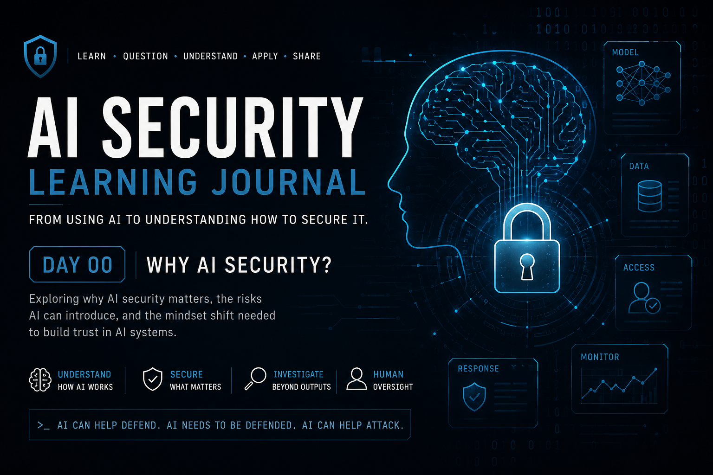

# Dia 00 — Por que Segurança de IA?

  

> Parte do meu **Diário de Aprendizado em Segurança de IA**, no qual documento minha compreensão pessoal, perguntas, erros e reflexões de cibersegurança enquanto estudo Segurança de IA.

## Visão geral

**Tempo de leitura:** aproximadamente 6 minutos

Neste texto, explico por que usar IA é diferente de compreender Segurança de IA, onde a IA gera valor para equipes de segurança e por que a confiança precisa ser investigada, não presumida.

**Principais conclusões:**

- A IA pode apoiar o trabalho de segurança e, ao mesmo tempo, tornar-se parte da superfície de ataque.
- Uma resposta apresentada com confiança não é automaticamente confiável.
- Proteger a IA começa com perguntas sobre o que pode falhar, quem pode influenciá-la e como suas decisões podem ser validadas.

## Por que comecei esta jornada

A Inteligência Artificial está se tornando parte de quase tudo o que fazemos em tecnologia.

Usamos IA para automatizar tarefas repetitivas, analisar grandes volumes de informações, resumir dados complexos, auxiliar investigações, gerar conteúdo e acelerar decisões.

Na cibersegurança, as possibilidades são ainda mais interessantes.

Um analista de SOC pode precisar processar milhares ou milhões de eventos. A IA pode ajudar a identificar padrões, correlacionar informações, priorizar alertas e reduzir o volume de trabalho repetitivo realizado manualmente.

Isso pode resultar em detecção e investigação mais rápidas, menor fadiga dos analistas e menos tempo entre a identificação de uma ameaça e a resposta a ela.

Mas, enquanto aprendia mais sobre IA, percebi algo importante:

**Usar IA e compreender como protegê-la são duas coisas muito diferentes.**

---

## A IA é mais do que uma interface

Para muitas pessoas, a experiência com IA começa com um prompt:

**Pergunta → IA → Resposta**

Do ponto de vista do usuário, isso pode ser suficiente.

Mas, sob a perspectiva da cibersegurança, comecei a fazer perguntas diferentes.

De onde veio esse modelo?

Quem o treinou?

Quais dados foram utilizados?

Posso confiar nessas fontes de dados?

Informações sensíveis podem ter sido incluídas?

Os dados de treinamento podem ter sido manipulados?

O que acontece se o modelo tiver acesso a sistemas corporativos?

Quem deveria poder acessar esses sistemas por meio da IA?

Alguém pode manipular o modelo para que ele se comporte de forma diferente da intenção original?

O que acontece quando o modelo apresenta, com confiança, uma resposta incorreta?

Essas perguntas mudaram a forma como passei a enxergar a IA.

Em vez de observar apenas:

`Prompt → Modelo → Resposta`

comecei a pensar em uma cadeia muito maior:

`Dados → Treinamento → Modelo → Acesso → Entrada → Decisão → Ação`

Cada parte dessa cadeia pode introduzir riscos.

---

## IA como ferramenta de cibersegurança

Um dos motivos pelos quais a IA é tão interessante para a cibersegurança é sua capacidade de operar em escala.

Seres humanos têm tempo e atenção limitados.

Máquinas podem processar continuamente grandes volumes de informações.

Em um ambiente defensivo, a IA pode ajudar a identificar padrões, classificar eventos, apoiar investigações e reduzir tarefas analíticas repetitivas.

Para mim, uma das possibilidades mais valiosas não é substituir o analista de segurança.

É ajudá-lo a gastar menos tempo processando ruído e mais tempo investigando o que realmente importa.

Mas isso cria outra pergunta:

**O que acontece quando a própria ferramenta de segurança também precisa ser protegida?**

---

## A IA também pode fazer parte da superfície de ataque

As mesmas capacidades que tornam a IA útil podem introduzir novas preocupações de segurança.

Se um modelo processa informações corporativas sensíveis, controles de acesso incorretos podem expor dados a pessoas que nunca deveriam recebê-los.

Se os dados utilizados para construir ou aprimorar o modelo forem manipulados, seu comportamento futuro também poderá ser afetado.

Se invasores conseguirem manipular a maneira como um sistema de IA interpreta instruções, o sistema poderá agir de forma diferente da esperada por seus desenvolvedores.

A IA também pode ajudar invasores a aumentar a velocidade, a escala e a capacidade de adaptação de ataques tradicionais.

Isso cria uma relação de segurança interessante:

**A IA pode ajudar a defender a organização.**

**A própria IA precisa ser defendida.**

**A IA também pode ajudar um invasor.**

Compreender essas três perspectivas está se tornando cada vez mais importante.

---

## A confiança tornou-se a questão central

Uma ideia começou a aparecer repetidamente durante meus estudos:

**Confiança.**

Quando um sistema de IA produz uma resposta, classificação ou recomendação, por que devo confiar nele?

Uma resposta com alto grau de confiança não significa automaticamente que ela está correta.

Um modelo pode se comportar de maneira inesperada por causa de problemas relacionados a dados, treinamento, ambiente, configuração ou à forma como está sendo utilizado.

Portanto, a saída de uma IA não deve ser automaticamente tratada como verdade absoluta.

Isso é especialmente importante na cibersegurança.

Imagine um sistema de IA recomendando:

> Ameaça detectada. Isole o banco de dados de produção.

Se essa recomendação estiver errada, executá-la sem validação pode criar um incidente de negócio em vez de evitá-lo.

Isso me levou a um princípio importante:

**A IA pode acelerar a detecção e a análise, mas decisões críticas ainda exigem validação adequada e supervisão humana.**

Quanto maior o impacto de negócio de uma decisão incorreta da IA, mais importante se torna essa validação.

---

## Pensando como um analista de segurança

Uma conexão com a cibersegurança tradicional ficou muito clara para mim.

Se o monitoramento mostra:

`Uso de CPU = 100%`

isso não significa automaticamente:

`Ataque DDoS`

É um indicador.

Investigamos antes de determinar a causa raiz.

Acredito que a Segurança de IA exige a mesma mentalidade.

Se o desempenho de um modelo piora repentinamente, isso não prova automaticamente que ele foi atacado, envenenado ou se tornou desatualizado.

Isso mostra que algo mudou e precisa ser investigado.

Uma maneira simples de pensar sobre isso é:

> **O monitoramento encontra a mudança. A investigação encontra a causa. A remediação trata a causa.**

A IA não elimina os fundamentos da investigação em cibersegurança.

Em muitos casos, ela torna esses fundamentos ainda mais importantes.

---

## Minha perspectiva inicial

Antes de iniciar esta jornada, grande parte do meu interesse em IA estava concentrada no que ela poderia fazer:

- automatizar atividades repetitivas;
- analisar grandes volumes de informação;
- melhorar a produtividade;
- auxiliar analistas de cibersegurança;
- acelerar a detecção e a investigação.

Continuo acreditando fortemente nesses benefícios.

Mas minha perspectiva está se tornando mais ampla.

Agora também quero compreender:

- de onde vêm os modelos;
- como seus dados são tratados;
- como os modelos são treinados e validados;
- o que pode influenciar seu comportamento;
- como o acesso deve ser controlado;
- como sistemas de IA devem ser monitorados;
- onde a supervisão humana continua necessária;
- como invasores podem atacar ou utilizar sistemas de IA.

Para mim, é aí que começa a **Segurança de IA**.

Não presumindo que a IA seja confiável ou não confiável.

Mas compreendendo **em que estamos confiando, por que estamos confiando e como podemos verificar essa confiança ao longo do tempo.**

---

## Principal conclusão

Minha maior conclusão do Dia 00 é simples:

> **Antes de aprender como proteger a IA, preciso compreender o que realmente estou tentando proteger.**

A IA não é apenas um chatbot ou um modelo respondendo a prompts.

Ela faz parte de um ecossistema maior que envolve dados, treinamento, modelos, infraestrutura, usuários, permissões, saídas, decisões e, em alguns casos, ações automatizadas.

Cada componente modifica a questão de segurança.

É isso que quero explorar ao longo deste diário de aprendizado.

---

## Próximo

**Dia 01 — Fundamentos da IA**

Antes de aprofundar ataques e defesas, preciso compreender o que existe por baixo de um sistema de IA:

**IA → Machine Learning → Deep Learning → Redes Neurais → Grandes Modelos de Linguagem**

Porque proteger algo começa por compreender como esse algo funciona.

---

## Referências

- [NIST — AI Risk Management Framework](https://www.nist.gov/itl/ai-risk-management-framework)
- [MITRE — ATLAS](https://atlas.mitre.org/)
- [OWASP — Machine Learning Security Top Ten](https://owasp.org/www-project-machine-learning-security-top-10/)

---

## Sobre este diário de aprendizado

Este repositório documenta minha jornada pessoal de aprendizado e minhas reflexões durante os estudos sobre Segurança de IA.

A jornada é inspirada por meus estudos com o material de AI Security da **TryHackMe**, combinados com minha experiência anterior em cibersegurança e gestão de incidentes.

As explicações, analogias, exemplos e conclusões apresentadas aqui representam minha própria compreensão e minhas reflexões.

Este repositório não reproduz laboratórios, perguntas, soluções ou conteúdo proprietário da TryHackMe.

O objetivo é simples:

**Aprender → Questionar → Compreender → Aplicar → Compartilhar**
