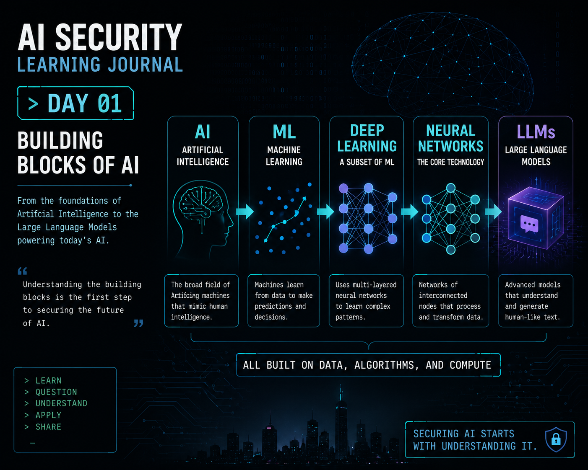

# Dia 01 — Fundamentos da IA

  

> Entendendo o que acontece por trás do prompt antes de tentar proteger o modelo.

## Visão geral

**Tempo de leitura:** cerca de 9 minutos

Este artigo constrói um modelo mental prático de Inteligência Artificial, Machine Learning, Deep Learning, redes neurais e LLMs antes de relacionar cada camada à segurança.

**Principais aprendizados:**

- Um LLM gera previsões; ele não apenas recupera uma resposta armazenada.
- Dados, treinamento, contexto, inferência e feedback criam questões de segurança diferentes.
- Entender o sistema por trás da interface revela onde a confiança pode falhar.

## De usar IA a entender IA

No Dia 00, comecei com uma pergunta de segurança:

**Por que eu deveria confiar em um sistema de IA?**

Mas, antes de me aprofundar em Segurança de IA, percebi que precisava entender o que existe por trás da interface.

Quando interagimos com um assistente de IA, a experiência parece simples:

`Entrada → IA → Saída`

Mas essa simplicidade esconde várias camadas de tecnologia.

Um ponto de partida útil para meu entendimento foi:

`Inteligência Artificial`
↓
`Machine Learning`
↓
`Deep Learning`
↓
`Redes Neurais`
↓
`Large Language Models`

Esses conceitos estão relacionados, mas não são equivalentes.

Compreender essas relações me deu uma base muito melhor para identificar onde problemas de segurança em IA podem surgir.

---

## Inteligência Artificial

Comecei a pensar em **Inteligência Artificial (IA)** como o conceito mais amplo.

IA descreve sistemas projetados para executar tarefas que normalmente exigem alguma forma de inteligência humana, como reconhecer padrões, interpretar informações, fazer previsões ou gerar respostas.

Machine Learning existe dentro desse campo mais amplo.

Então, em vez de pensar:

`IA = Machine Learning`

Passei a pensar:

`IA → Machine Learning`

IA é o campo mais amplo.

Machine Learning é uma das formas de construir comportamentos inteligentes.

---

## Machine Learning

A programação tradicional geralmente segue uma estrutura como:

`Regras + Dados → Resultado`

O desenvolvedor define explicitamente a lógica que deve ser seguida.

Machine Learning muda essa relação.

Em vez de definir manualmente todas as regras possíveis, fornecemos dados e permitimos que o sistema aprenda padrões que poderão ser usados para fazer previsões ou classificações.

De forma conceitual:

`Dados de treinamento → Aprendizado → Modelo`

Depois:

`Novos dados → Modelo → Previsão`

Essa distinção se tornou importante para mim sob a perspectiva de segurança.

Se o comportamento é influenciado pelo que o modelo aprende com os dados, então a **qualidade, a origem e a integridade desses dados também se tornam questões de segurança.**

---

## Aprendizado supervisionado

Uma das abordagens que estudei foi o **aprendizado supervisionado**.

Nesse caso, os dados de treinamento contêm rótulos ou resultados conhecidos.

Um exemplo simples em cibersegurança seria:

`E-mail → Phishing`

`E-mail → Legítimo`

O modelo recebe exemplos cuja classificação esperada já é conhecida e aprende relações que podem ajudá-lo a classificar exemplos futuros.

Pensar em eventos de um SOC tornou esse conceito especialmente intuitivo para mim.

Se já tenho eventos históricos corretamente classificados por analistas, essas classificações podem fazer parte do processo de aprendizado.

A ideia importante é:

**O modelo aprende com exemplos para os quais alguma forma de resposta esperada já está disponível.**

---

## Aprendizado não supervisionado

O aprendizado não supervisionado aborda o problema de outra maneira.

Em vez de fornecer ao modelo rótulos explícitos para cada exemplo, o sistema tenta identificar padrões, estruturas, semelhanças ou grupos nos dados.

Sob a perspectiva da cibersegurança, isso imediatamente me lembrou da detecção de anomalias.

Em vez de informar ao sistema:

`Este evento específico = malicioso`

podemos estar interessados em descobrir:

`Este comportamento é significativamente diferente dos padrões normalmente observados.`

Isso não significa automaticamente que o comportamento seja malicioso.

Significa que ele pode merecer investigação.

Essa distinção está fortemente ligada a um princípio que já utilizo em cibersegurança:

> **Uma anomalia é um indicador, não necessariamente a causa raiz.**

---

## Aprendizado semissupervisionado

O aprendizado semissupervisionado fica entre as abordagens supervisionada e não supervisionada.

Em vez de termos rótulos para todo o conjunto de dados, podemos ter uma pequena quantidade de dados rotulados junto de uma quantidade muito maior de dados não rotulados.

De forma conceitual:

`Pequeno conjunto rotulado + Grande conjunto não rotulado → Aprendizado`

Isso fez sentido para mim ao pensar em um ambiente de SOC.

As equipes de segurança podem ter um número menor de eventos já investigados e classificados por analistas, enquanto um volume muito maior de eventos históricos permanece sem classificação.

Classificar tudo manualmente pode ser caro e demorado.

O aprendizado semissupervisionado permite usar a quantidade menor de informações conhecidas para orientar o aprendizado sobre o conjunto maior.

A distinção que passei a usar para lembrar essas abordagens é:

- **Supervisionado:** já tenho as respostas esperadas para os exemplos de treinamento.
- **Não supervisionado:** não forneço essas respostas; o sistema procura estruturas e padrões.
- **Semissupervisionado:** tenho alguns exemplos rotulados que orientam o aprendizado entre muitos exemplos não rotulados.

---

## Aprendizado por reforço

Outra abordagem de aprendizado apresentou uma ideia diferente:

**feedback baseado em ações e resultados.**

Em vez de simplesmente receber exemplos rotulados, um agente pode executar ações e receber feedback conforme o resultado.

De forma conceitual:

`Estado → Ação → Feedback → Ajuste`

Isso me ajudou a entender por que o feedback pode influenciar comportamentos futuros.

Um resultado positivo pode reforçar um comportamento.

Um resultado negativo pode desencorajá-lo.

O ponto interessante sob a perspectiva de segurança é que o próprio feedback se torna importante.

Se o mecanismo de feedback estiver incorreto, for manipulado ou mal projetado, o comportamento reforçado também poderá ser indesejado.

---

## Deep Learning

Deep Learning é um subconjunto de Machine Learning que utiliza redes neurais com múltiplas camadas.

Foi aqui que meu modelo mental começou a ficar mais visual.

Em vez de pensar em uma única decisão, comecei a imaginar informações sendo processadas progressivamente por várias camadas.

De forma conceitual:

`Camada de entrada → Camadas ocultas → Camada de saída`

A **camada de entrada** recebe as informações.

As **camadas ocultas** processam progressivamente relações e representações.

A **camada de saída** produz a previsão ou representação resultante.

---

## Pensando sobre redes neurais

Uma analogia que me ajudou a entender redes neurais foi o reconhecimento de imagens.

Imagine que a entrada seja uma imagem.

Em um nível básico, o sistema recebe informações numéricas representando pixels.

As etapas iniciais do processamento podem identificar características simples.

As etapas mais profundas podem combinar essas características em padrões cada vez mais complexos.

De forma conceitual:

`Pixels`
↓
`Bordas / Formas`
↓
`Características`
↓
`Representação de nível mais alto`
↓
`Previsão`

Por exemplo, combinações de pixels podem contribuir para a detecção de linhas, curvas, formas e, por fim, características associadas a objetos maiores.

A percepção importante para mim foi que camadas mais profundas podem construir representações cada vez mais complexas a partir de informações mais simples.

---

## Entrada, camadas ocultas e saída

Também comecei a aplicar esse conceito à cibersegurança.

Imagine um e-mail sendo analisado.

### Entrada

O modelo pode receber informações como:

- remetente;
- data e hora;
- conteúdo da mensagem;
- solicitação feita;
- outras características disponíveis.

### Processamento oculto

O sistema pode analisar relações entre essas entradas e identificar padrões aprendidos durante o treinamento.

### Saída

O resultado final poderia ser algo como:

`Possível phishing`

O ponto principal é que a saída resulta do processamento de relações aprendidas.

Não se trata simplesmente de uma regra `IF/ELSE` codificada para cada e-mail possível.

Essa distinção se torna extremamente importante quando começamos a discutir como sistemas de IA podem falhar ou ser manipulados.

---

## Large Language Models

Os Large Language Models me apresentaram outra ideia importante:

**previsão.**

Um LLM não recupera simplesmente uma frase completa e predefinida toda vez que fazemos uma pergunta.

Durante o pré-treinamento, o modelo processa enormes quantidades de texto e tenta repetidamente prever qual token deve vir em seguida.

Uma representação simplificada seria:

`Contexto → Possíveis próximos tokens → Previsão`

Depois, o processo continua:

`Contexto + token previsto → Novo contexto → Próxima previsão`

construindo a resposta sucessivamente.

Durante o treinamento, previsões incorretas são comparadas ao resultado esperado, e os parâmetros do modelo são ajustados por meio de **backpropagation**, aumentando a probabilidade de previsões melhores em situações semelhantes no futuro.

Isso me ajudou a abandonar a ideia de que um LLM apenas pesquisa uma resposta existente em um enorme banco de dados.

Em vez disso, ele gera uma resposta por meio de uma sequência de previsões baseadas nas relações aprendidas durante o treinamento e no contexto disponível naquele momento.

---

## O contexto importa

A probabilidade, sozinha, não é suficiente para explicar uma geração de linguagem útil.

O contexto influencia fortemente qual continuação faz sentido.

A mesma palavra pode ter significados diferentes dependendo das informações ao redor.

Por exemplo, em inglês:

`bank`

pode significar uma instituição financeira ou a margem de um rio, dependendo do contexto.

O modelo precisa das informações ao redor para determinar quais relações são mais relevantes para a solicitação atual.

Isso me trouxe outra percepção importante:

**A qualidade de uma resposta de IA depende não apenas do que o modelo aprendeu, mas também do contexto que ele recebe ao realizar uma inferência.**

---

## Treinamento e refinamento

Outra percepção importante foi que um LLM útil não é simplesmente exposto a uma grande quantidade de texto e imediatamente colocado em produção.

O treinamento e o refinamento envolvem vários processos.

Em alto nível, passei a pensar no ciclo de vida assim:

`Dados em grande escala`
↓
`Pré-treinamento`
↓
`Modelo`
↓
`Refinamento / Feedback`
↓
`Comportamento mais útil`

O feedback humano também pode contribuir para alinhar o comportamento do modelo aos resultados esperados.

Isso me ajudou a entender que o comportamento final observado em um assistente de IA resulta de muito mais do que apenas coletar um grande conjunto de dados.

---

## Por que isso importa para a segurança

Essa era a conexão que eu procurava.

Se um sistema de IA depende de:

- dados de treinamento;
- padrões aprendidos;
- arquitetura do modelo;
- contexto;
- feedback;
- probabilidades;
- e refinamento posterior;

então a segurança não pode se concentrar apenas na saída final.

Cada parte pode influenciar o comportamento.

Isso faz com que novas perguntas de segurança surjam naturalmente:

**E se os dados de treinamento forem manipulados?**

**E se dados sensíveis forem incluídos?**

**E se o contexto for construído de forma maliciosa?**

**E se o feedback reforçar um comportamento indesejado?**

**E se o modelo tiver um desempenho excelente em exemplos conhecidos, mas ruim em exemplos novos?**

Essas perguntas nos levam diretamente à Segurança de IA.

---

## O que mudou no meu entendimento

Antes de estudar esses fundamentos, eu enxergava a IA principalmente pela interface:

`Prompt → Resposta`

Agora meu modelo mental está mais próximo de:

`Dados`
↓
`Treinamento`
↓
`Relações aprendidas`
↓
`Modelo`
↓
`Contexto`
↓
`Inferência`
↓
`Saída`

Essa diferença importa.

Se eu entendo apenas a saída, consigo avaliar se gostei da resposta.

Se entendo melhor o processo por trás da saída, posso começar a perguntar **por que o sistema se comportou daquela maneira e onde os problemas de segurança podem ter surgido.**

E isso está muito mais próximo da mentalidade necessária para Segurança de IA.

---

## Principal aprendizado

Meu maior aprendizado do Dia 01 é:

> **Antes de tentar proteger um sistema de IA, preciso entender o que acontece por trás do prompt.**

IA é o campo mais amplo.

Machine Learning permite que sistemas aprendam padrões a partir de dados.

Deep Learning utiliza redes neurais com múltiplas camadas.

Redes neurais transformam progressivamente informações em representações e saídas.

Large Language Models utilizam relações aprendidas e contexto para gerar linguagem por meio de previsões sucessivas.

E cada nova camada de entendimento me oferece outro lugar para perguntar:

**O que pode dar errado aqui?**

---

## Próximo

**Dia 02 — Ameaças à Segurança de IA**

Agora que tenho um modelo mental melhor do que existe por trás de um sistema de IA, a próxima pergunta fica muito mais interessante:

> **Como esses sistemas podem ser atacados, manipulados, utilizados indevidamente ou se comportar de maneiras que não esperávamos?**

É aí que a discussão sobre segurança realmente começa.

---

## Referências

- [NIST — Adversarial Machine Learning: A Taxonomy and Terminology of Attacks and Mitigations](https://csrc.nist.gov/pubs/ai/100/2/e2025/final)
- [Google Research — Attention Is All You Need](https://research.google/pubs/attention-is-all-you-need/)
- [Hugging Face — Curso de Processamento de Linguagem Natural](https://huggingface.co/learn/nlp-course/)

---

## Sobre este diário de aprendizado

Este repositório documenta minha jornada pessoal de aprendizado e minhas reflexões enquanto estudo Segurança de IA.

A jornada de aprendizado é inspirada nos meus estudos com o material de AI Security da **TryHackMe**, combinados à minha experiência anterior com cibersegurança e gestão de incidentes.

As explicações, analogias, exemplos e conclusões apresentados aqui representam meu próprio entendimento e minhas reflexões.

Este repositório não reproduz laboratórios, perguntas, soluções ou conteúdo proprietário da TryHackMe.

**Aprender → Questionar → Compreender → Aplicar → Compartilhar**
