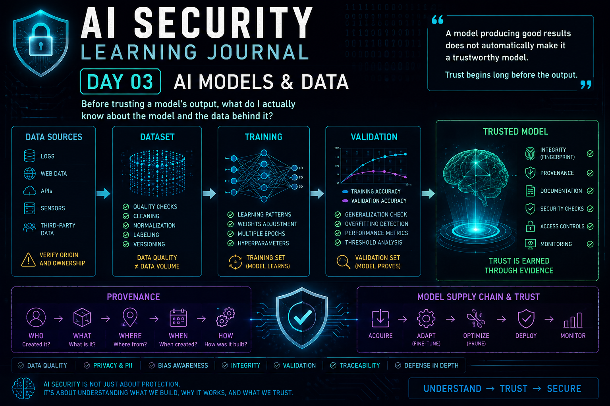

# Dia 03 — Modelos e Dados de IA

  

> Antes de confiar na saída de um modelo de IA, preciso entender em que estou confiando por trás dela.

## Visão geral

**Tempo de leitura:** cerca de 13 minutos

Este artigo examina as evidências necessárias para confiar em modelos e conjuntos de dados, incluindo proveniência, representatividade, privacidade, validação, overfitting e riscos da cadeia de suprimentos.

**Principais aprendizados:**

- O tamanho de um conjunto de dados não garante sua qualidade.
- Bons resultados em testes não respondem a todas as perguntas sobre segurança e confiança.
- Proveniência e validação precisam acompanhar dados e modelos durante todo o ciclo de vida.

## De proteger a IA a confiar nela

O Dia 02 mudou minha forma de pensar sobre comportamentos inesperados da IA.

Uma saída inesperada é um indicador que merece investigação — não uma prova de que já conheço a causa raiz.

Mas isso trouxe outra pergunta:

> **Antes de investigar se um modelo foi atacado, o que realmente sei sobre o próprio modelo?**

De onde ele veio? Quem o desenvolveu? Quais dados foram usados no treinamento? Esses dados eram confiáveis, representativos e livres de informações que não deveriam estar ali? Como o modelo foi validado? O que mudou entre suas versões?

Essas perguntas deslocaram minha atenção para etapas anteriores do ciclo de vida.

Em vez de começar com:

`Modelo → Saída`

passei a pensar em:

`Fonte dos dados → Dataset → Treinamento → Validação → Modelo → Implantação → Saída`

Sob a perspectiva de segurança, cada etapa cria uma pergunta sobre confiança.

---

## A primeira pergunta: de onde veio este modelo?

Baixar um modelo e executá-lo com sucesso não o torna automaticamente confiável.

Antes de adotar um modelo pré-treinado, eu gostaria de entender:

- quem o desenvolveu e treinou;
- qual é sua origem;
- qual licença determina como ele pode ser utilizado;
- quais dados foram empregados;
- qual era o tamanho e a diversidade do dataset;
- quais versões existiram antes da atual;
- quais versões atingiram a qualidade esperada;
- quais técnicas de treinamento ou refinamento foram utilizadas;
- se foram realizadas verificações de proveniência e pré-treinamento;
- se dados sensíveis ou pessoalmente identificáveis foram encontrados e tratados.

Isso não é apenas documentação.

É parte da **postura de segurança do modelo**.

Um modelo de origem desconhecida introduz incerteza antes mesmo de receber meus próprios dados.

---

## Proveniência

Passei a pensar em **proveniência** como a história por trás do modelo e de seus dados.

De forma conceitual:

> **Quem → O quê → Onde → Quando → Como**

Para um dataset, a proveniência ajuda a explicar de onde vieram as informações e como elas foram coletadas, processadas, transformadas e validadas.

Para um modelo, ajuda a estabelecer quem o criou, como foi treinado, quais versões existiram e o que aconteceu antes de o artefato chegar até mim.

Isso se torna especialmente importante ao utilizar modelos pré-treinados ou fornecidos por terceiros.

Sem proveniência, posso saber que o modelo funciona.

Mas sei muito menos sobre **por que deveria confiar nele**.

---

## Tamanho do dataset não significa qualidade

Uma suposição que questionei foi a de que mais dados produzem automaticamente um modelo melhor.

Não produzem.

Um dataset pode conter milhões de registros e ainda causar problemas se esses registros forem:

- incorretos;
- duplicados;
- mal rotulados;
- irrelevantes;
- desatualizados;
- manipulados;
- desbalanceados;
- pouco representativos do ambiente real.

Sob a perspectiva de segurança, um grande volume sem validação adequada pode apenas produzir mais ruído.

Meu modelo mental passou a ser:

> **Mais dados ≠ Dados melhores**

Antes de incorporar informações ao treinamento, quero entender sua origem, relevância, integridade e qualidade.

---

## Diversidade e representatividade importam

A qualidade também depende **daquilo que o dataset representa**.

Imagine um modelo de cibersegurança criado para operar em ambientes Windows e Linux.

Ele pode ter um excelente desempenho nos testes. Entretanto, se a maioria dos exemplos de treinamento veio de ambientes Windows, esse resultado não demonstra necessariamente que ele compreende bem os comportamentos do Linux.

O modelo pode não estar quebrado nem ter sido envenenado. Talvez apenas não tenha recebido exemplos suficientes daquele ambiente.

`Predominância de dados Windows → Representação mais forte de Windows`

enquanto:

`Poucos dados Linux → Representação limitada de Linux`

Um desempenho ruim em determinado ambiente não deve ser classificado imediatamente como ataque. Primeiro, preciso investigar a partir de quais informações o modelo realmente aprendeu.

---

## O viés pode estar incorporado aos dados

Isso também me ajudou a compreender **viés** de outra maneira.

Viés não significa necessariamente que alguém manipulou o modelo intencionalmente. Ele pode surgir da própria distribuição dos dados de treinamento.

Se uma arquitetura, população, situação ou padrão domina o dataset, o modelo pode aprender relações que funcionam melhor para essa representação dominante.

A pergunta de segurança passa a ser:

> **O dataset representa o ambiente no qual este modelo realmente operará?**

É preciso olhar além da acurácia geral e entender como o desempenho se distribui entre cenários diferentes.

Um modelo pode parecer preciso no total e ainda assim falhar em uma parte importante do ambiente.

---

## Dados sensíveis mudam o risco

A inspeção do dataset também precisa considerar privacidade.

Antes do treinamento, eu gostaria de saber se os dados contêm:

- informações pessoalmente identificáveis (PII);
- credenciais;
- identificadores internos;
- informações corporativas confidenciais;
- dados de clientes;
- outras informações sensíveis.

Se essas informações existirem, presumir que o modelo nunca as revelará não é um controle suficiente.

A abordagem mais segura começa antes. Os dados devem ser identificados, classificados e tratados conforme os requisitos da organização.

Dependendo do caso, isso pode envolver:

- minimização;
- sanitização;
- mascaramento;
- anonimização ou pseudonimização;
- remoção de campos sensíveis desnecessários.

> **Não espere o modelo expor uma informação sensível para perguntar se ela deveria ter entrado no treinamento.**

---

## Apagar o arquivo original pode não resolver

Suponha que uma informação sensível tenha sido incluída acidentalmente no dataset. Mais tarde, alguém identifica o erro e apaga o arquivo original.

Isso não significa que o problema desapareceu do modelo treinado.

O treinamento já influenciou seus parâmetros. O modelo não consulta simplesmente aquele arquivo original sempre que recebe um prompt.

Por isso, prevenção é essencial. É muito mais fácil validar e sanitizar informações **antes do treinamento** do que presumir que apagar a fonte desfará completamente o que foi aprendido.

---

## Verificações prévias ao treinamento são controles de segurança

Passei a enxergar a validação do dataset como um controle de segurança, não apenas como uma atividade de ciência de dados.

`Fonte`
↓
`Integridade`
↓
`Qualidade`
↓
`Diversidade`
↓
`Dados sensíveis`
↓
`Adequação`
↓
`Treinamento`

O objetivo não é garantir que nada jamais dará errado. É reduzir problemas evitáveis antes que sejam incorporados ao modelo.

Se informações sensíveis ainda alcançarem etapas posteriores, controles adicionais de acesso, saída, monitoramento e guardrails oferecem novas camadas de proteção.

Isso é **defesa em profundidade aplicada ao ciclo de vida da IA**.

---

## Meu aprendizado sobre dados

> **Um modelo só pode aprender a partir do mundo que mostramos a ele — e esse mundo pode ser incompleto, enviesado, sensível, ruidoso ou incorreto.**

Antes de avaliar o modelo, preciso avaliar sua base de dados.

As perguntas deixam de ser apenas “quanto dado tenho?” e passam a incluir:

- De onde ele veio?
- É confiável?
- É representativo?
- Contém informações que não deveriam estar ali?
- Quais verificações de segurança aconteceram antes do treinamento?

Minha primeira mudança de entendimento no Dia 03 foi simples:

> **Desempenho do modelo e confiança no modelo não são a mesma coisa.**

Antes de perguntar “qual é a acurácia?”, também quero perguntar:

> **De onde vieram o modelo e seus dados, e o que aconteceu com eles antes de chegarem até mim?**

---

## Treinamento não é validação

Outra distinção importante foi separar o **desempenho no treinamento** do **desempenho na validação**.

Durante o treinamento, o modelo aprende repetidamente com o dataset. Avaliá-lo apenas com os mesmos dados que ele já viu não diz o suficiente sobre seu comportamento diante de novas informações.

É por isso que um conjunto de validação separado importa:

`Conjunto de treinamento → Aprender`

`Conjunto de validação → Avaliar`

Os dados de validação ajudam a responder se o modelo consegue generalizar o que aprendeu para exemplos que não fizeram parte do processo de aprendizado.

Em segurança, resultados excelentes no treinamento podem criar uma falsa sensação de confiança.

---

## Épocas e overfitting

Uma **época** representa uma passagem completa pelo dataset de treinamento.

Várias épocas permitem que o modelo ajuste repetidamente o que aprendeu. Mas mais treinamento não significa automaticamente um modelo melhor.

Se ele se adaptar demais aos mesmos exemplos, poderá reconhecê-los muito bem e ter desempenho pior diante de novos dados. Isso é **overfitting**.

Um modelo mental simplificado seria:

> **O desempenho no treinamento melhora enquanto a capacidade de generalização piora.**

Em cibersegurança, um modelo de detecção pode reconhecer perfeitamente os ataques presentes nos dados de treinamento e falhar diante de variações que nunca viu.

---

## A validação ajuda a revelar o problema

O conjunto de validação não é apenas um conceito de Machine Learning. Ele faz parte das evidências necessárias para confiar no comportamento do modelo.

Se o desempenho no treinamento continua melhorando enquanto a validação piora:

`Acurácia no treinamento ↑`

`Acurácia na validação ↓`

isso merece investigação.

O objetivo não é fazer o modelo funcionar perfeitamente naquilo que já conhece, mas construir um modelo capaz de operar de forma confiável com dados que nunca viu.

Essa diferença é crítica porque atacantes, ambientes e comportamentos não permanecerão idênticos ao dataset de treinamento.

---

## Reutilizar modelos cria novas perguntas de confiança

Nem sempre é necessário construir um modelo do zero. Organizações podem adaptar modelos pré-treinados por meio de técnicas como **fine-tuning**.

Isso economiza tempo, dados e recursos computacionais, mas também significa herdar uma história:

`Dados anteriores → Treinamento anterior → Modelo pré-treinado → Meu fine-tuning`

Adicionar meus próprios dados confiáveis não remove automaticamente comportamentos ou riscos herdados.

Antes de confiar em um modelo de terceiros, quero entender sua origem, licença, finalidade, documentação, histórico de treinamento e limitações conhecidas.

> **Fine-tuning acrescenta meu conhecimento. Ele não apaga a história do modelo.**

---

## Dados sintéticos ampliam a cobertura, mas exigem validação

Dados sintéticos podem ajudar quando exemplos reais são escassos, caros, sensíveis ou difíceis de coletar.

Em cibersegurança, eles podem ampliar a variedade de situações representadas no treinamento. Ainda assim, não devem ser considerados confiáveis apenas por terem sido gerados artificialmente.

Dados sintéticos ruins podem reforçar padrões irreais, introduzir viés ou reduzir a qualidade do aprendizado.

> **A qualidade da saída continua dependendo da qualidade e do controle da entrada.**

Dados sintéticos podem ampliar a cobertura. Eles não eliminam a necessidade de validação.

---

## Otimização envolve escolhas

Modelos também podem ser otimizados para reduzir tamanho, consumo computacional ou tempo de inferência.

Um exemplo é o **pruning**, que remove conexões consideradas menos importantes de uma rede neural.

Isso pode melhorar a eficiência, mas a avaliação não deveria se limitar a:

`Modelo menor → Modelo mais rápido`

Também preciso perguntar:

`Qual capacidade foi perdida?`

Se a otimização reduzir a capacidade de reconhecer comportamentos raros, mas relevantes para segurança, o ganho de desempenho pode criar risco operacional.

> **Otimização é uma escolha entre benefícios e perdas, não uma melhoria automática.**

---

## A cadeia de suprimentos do modelo importa

Todos esses conceitos levam a uma preocupação maior: a **confiança na cadeia de suprimentos**.

Imagine baixar um modelo de origem desconhecida. Ele funciona, recebe fine-tuning com dados da organização e apresenta resultados aceitáveis. Posso confiar nele?

Não necessariamente.

Talvez eu ainda saiba pouco sobre:

- quem o criou;
- de onde vieram os dados de treinamento;
- se o artefato foi modificado;
- quais comportamentos foram herdados;
- se houve poisoning em uma etapa anterior;
- quais limitações e vieses já existiam.

Assim como em outros problemas de supply chain, um artefato funcional não é automaticamente confiável.

> **Funcionalidade demonstra que algo funciona. Proveniência ajuda a demonstrar por que devo confiar.**

Origem, integridade, documentação, licenciamento, testes e validação fazem parte da decisão de segurança.

---

## O que mudou no meu entendimento

Antes, eu começaria perguntando:

> **O modelo funciona?**

Agora quero saber também:

- De onde ele veio?
- Quais dados o moldaram?
- Como foi treinado e validado?
- O que pode ter herdado?
- O que mudou durante fine-tuning ou otimização?
- Quais evidências mostram que o artefato é confiável?

A confiança em IA não começa na saída. Ela começa muito antes no ciclo de vida.

---

## Principal aprendizado

> **Um modelo produzir bons resultados não o torna automaticamente confiável.**

A confiança depende da cadeia por trás dele:

`Proveniência → Dados → Treinamento → Validação → Modelo → Implantação`

Cada etapa pode introduzir suposições, limitações, vieses, problemas de privacidade, riscos de segurança ou comportamentos herdados.

Desempenho importa. Em segurança, também preciso de **rastreabilidade, validação, integridade e evidências**.

---

## Encerrando este primeiro bloco

Nestes quatro primeiros artigos, meu modelo mental de Segurança de IA mudou bastante.

**Dia 00** perguntou por que a própria IA precisa ser protegida.

**Dia 01** mostrou o que existe por trás do prompt.

**Dia 02** explorou o que pode dar errado e por que comportamentos inesperados exigem investigação.

**Dia 03** voltou ainda mais no ciclo e perguntou se o modelo e seus dados deveriam ter sido considerados confiáveis desde o início.

A progressão ficou assim:

`Compreender → Modelar ameaças → Investigar → Estabelecer confiança`

Um princípio conecta tudo:

> **Não confie em algo apenas porque funciona. Entenda em que está confiando e por quê.**

---

## Referências

- [NIST — AI Risk Management Framework 1.0](https://www.nist.gov/publications/artificial-intelligence-risk-management-framework-ai-rmf-10)
- [NIST — Managing Bias in Artificial Intelligence](https://www.nist.gov/publications/towards-standard-identifying-and-managing-bias-artificial-intelligence)
- [Google Research — Model Cards for Model Reporting](https://research.google/pubs/model-cards-for-model-reporting/)
- [Hugging Face — Model Cards](https://huggingface.co/docs/hub/model-cards)

---

## Sobre este diário de aprendizado

Este repositório documenta minha jornada pessoal de aprendizado e minhas reflexões enquanto estudo Segurança de IA.

A jornada é inspirada nos meus estudos com o material de AI Security da **TryHackMe**, combinados à minha experiência anterior com cibersegurança e gestão de incidentes.

As explicações, analogias, exemplos e conclusões apresentados aqui representam meu próprio entendimento e minhas reflexões.

Este repositório não reproduz laboratórios, perguntas, soluções ou conteúdo proprietário da TryHackMe.

**Aprender → Questionar → Compreender → Aplicar → Compartilhar**
