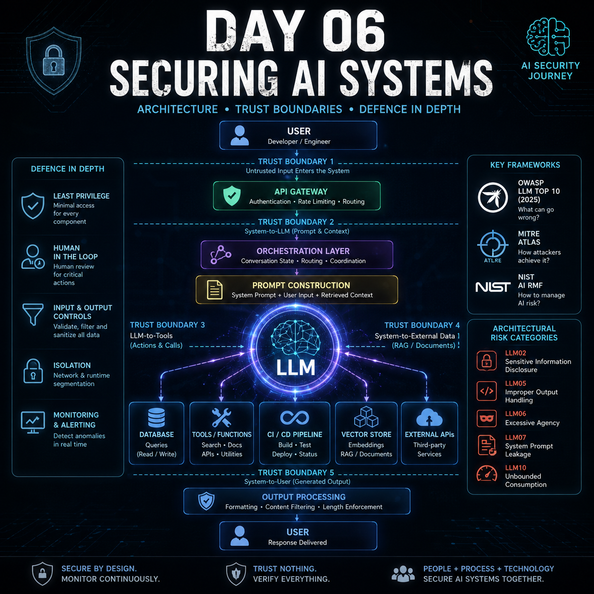

# Dia 06 — Protegendo Sistemas de IA

<p align="center">
  
</p>

> Proteger a IA significa proteger a arquitetura, as permissões, os fluxos de dados, os limites de confiança e as ações ao redor do modelo.

## Visão Geral

**Tempo de leitura:** cerca de 8 minutos

Este artigo deixa as preocupações restritas ao modelo e passa a considerar toda a arquitetura da aplicação de IA e os controles necessários ao seu redor.

**Principais aprendizados:**

- O modelo é apenas um componente de um sistema de IA.
- OWASP, MITRE ATLAS e NIST AI RMF respondem a questões complementares de segurança e governança.
- Privilégio mínimo, monitoramento, validação e aprovação humana limitam as consequências de uma falha do modelo.

## Jornada de Segurança de IA da TryHackMe

A sala de hoje mudou a forma como penso sobre segurança de IA.

Até agora, grande parte do meu foco estava no próprio modelo: entradas adversariais, viés, data poisoning, vazamento e o comportamento dos sistemas de machine learning.

O Dia 6 levou a discussão um nível acima.

A principal lição foi simples:

> Proteger a IA não é apenas proteger o modelo. É proteger toda a arquitetura ao redor dele.

Um sistema de IA em produção pode incluir a interface do usuário, o API gateway, a camada de orquestração, a construção do prompt, o próprio LLM, ferramentas, fontes de dados externas, sistemas de logging, processamento da saída e bancos de dados vetoriais.

Cada conexão entre esses componentes pode se tornar um limite de confiança — e cada limite de confiança pode se tornar uma superfície de ataque.

---

## De Aplicações Tradicionais a Sistemas de IA

Aplicações web tradicionais normalmente esperam entradas relativamente estruturadas.

Um campo pode esperar:

* um nome de usuário;
* uma data;
* um ID;
* um número;
* uma opção predefinida.

Os controles de segurança podem validar os formatos esperados e rejeitar conteúdo inesperado.

As aplicações de IA introduzem algo fundamentalmente diferente:

**linguagem natural em formato livre.**

Um usuário pode enviar praticamente qualquer coisa ao modelo.

Isso significa que as equipes de segurança precisam considerar não apenas os problemas tradicionais de injeção e validação, mas também questões como:

* O usuário está tentando descobrir instruções internas?
* A solicitação está tentando manipular o modelo?
* A solicitação poderia acionar uma ferramenta externa?
* O usuário está consumindo uma quantidade excessiva de tokens ou recursos computacionais?
* O modelo possui permissões das quais não precisa realmente?
* Informações sensíveis poderiam ser expostas na resposta?
* Quais informações estão sendo mantidas nos logs?

Isso aumenta significativamente a superfície de segurança.

---

## Arquitetura de IA e Limites de Confiança

O exercício apresentou cinco limites de confiança importantes:

1. **Usuário para Sistema**
2. **Sistema para LLM**
3. **LLM para Ferramentas**
4. **Sistema para Dados Externos**
5. **Sistema para Usuário**

Uma distinção que ficou mais clara para mim durante a revisão é a diferença entre um **componente** e um **limite**.

Por exemplo:

**Construção do Prompt** é uma camada responsável por combinar o system prompt, a entrada do usuário e o contexto recuperado.

**Sistema para LLM**, por outro lado, é o limite de confiança atravessado quando esse prompt construído é enviado ao modelo.

Compreender essa distinção ajuda na modelagem de ameaças de uma aplicação de IA.

---

## Três Frameworks, Três Perguntas Diferentes

Outro conceito importante foi entender como OWASP, MITRE e NIST se complementam.

### OWASP LLM Top 10 — O QUÊ?

A OWASP ajuda a classificar vulnerabilidades e riscos importantes que afetam aplicações com LLMs.

### MITRE ATLAS — COMO?

O MITRE ATLAS analisa as táticas e técnicas utilizadas por adversários contra sistemas de IA e machine learning.

### NIST AI RMF — COMO GOVERNAMOS O RISCO?

O NIST AI RMF oferece uma abordagem organizacional baseada em:

* Governar
* Mapear
* Medir
* Gerenciar

Achei esta relação particularmente útil:

```text
OWASP → O que pode dar errado?
MITRE ATLAS → Como um atacante pode fazer isso?
NIST AI RMF → Como a organização deve governar e gerenciar o risco?
```

---

## Cinco Riscos de IA no Nível do Sistema

A sala se concentrou em cinco categorias da OWASP.

### LLM10 — Consumo Irrestrito

Um atacante pode abusar do uso de tokens, do tamanho das solicitações, da concorrência ou dos recursos computacionais.

Os possíveis impactos incluem:

* negação de serviço;
* degradação do desempenho;
* esgotamento da infraestrutura;
* custos inesperados de cloud ou API.

Os controles relevantes incluem rate limiting, limites para o tamanho das solicitações, cotas e limites de custo.

---

### LLM07 — Vazamento do System Prompt

System prompts nunca devem ser tratados como armazenamento seguro.

Se URLs internas, credenciais, detalhes da arquitetura ou instruções sensíveis forem incluídos em um prompt, sua divulgação poderá revelar informações valiosas sobre o ambiente.

Meu aprendizado:

**Projete os system prompts supondo que, algum dia, alguém poderá inspecionar seu conteúdo.**

Segredos não devem estar ali.

---

### LLM05 — Tratamento Inadequado da Saída

A saída de um LLM deve ser considerada não confiável.

Um modelo pode gerar:

* SQL;
* comandos de shell;
* HTML;
* URLs;
* instruções estruturadas.

Se outro sistema executar diretamente esse conteúdo, o LLM poderá se tornar parte de uma cadeia de injeção.

Uma distinção importante que aprendi é que uma resposta incorreta do modelo, por si só, não representa necessariamente Tratamento Inadequado da Saída.

A situação perigosa aparece quando a saída gerada chega a outro componente e é processada ou executada de forma insegura.

---

### LLM06 — Agência Excessiva

Esse se tornou um dos riscos mais interessantes para mim.

A Agência Excessiva pode aparecer por meio de:

* **Funcionalidade Excessiva**
* **Permissões Excessivas**
* **Autonomia Excessiva**

O exemplo do TryAssist demonstrou os três casos.

Um assistente de revisão de código não deveria precisar automaticamente de acesso administrativo a um banco de dados de produção, capacidade de implantar aplicações, modificar repositórios, comunicar-se em canais privados e fazer merge de código de forma independente.

A IA não elimina o princípio do privilégio mínimo.

Ela torna o privilégio mínimo ainda mais importante.

---

### LLM02 — Divulgação de Informações Sensíveis

Dados sensíveis podem vazar mesmo quando não existe um atacante.

Desenvolvedores podem colar:

* credenciais;
* chaves SSH;
* tokens de API;
* código-fonte interno;
* informações pessoais;
* informações sobre a arquitetura.

Se as conversas forem armazenadas sem filtragem, criptografia, controle de acesso adequado ou políticas de retenção, a própria aplicação se tornará uma fonte de exposição.

Este foi um lembrete importante:

**Um incidente de segurança nem sempre exige exploração. Uma arquitetura deficiente pode vazar informações enquanto funciona exatamente como foi projetada.**

---

## Auditando o TryAssist

O exercício prático mostrou várias decisões arquiteturais de alto risco.

O sistema tinha capacidades muito além daquelas que um assistente de revisão de código normalmente deveria exigir.

Entre os exemplos estavam:

* acesso de leitura e escrita ao repositório;
* merge automático de pull requests;
* capacidade de implantação;
* privilégios de administrador no banco de dados de produção;
* acesso de leitura e escrita ao Slack;
* logging das conversas sem filtragem de PII.

O exemplo do banco de dados foi particularmente importante.

A IA operava com uma função administrativa no banco, capaz de ler, inserir, modificar, excluir, criar e remover objetos.

Para um assistente de revisão de código, isso viola drasticamente o princípio do privilégio mínimo.

---

## Somente Leitura Não Significa Ausência de Risco

Um ponto que ficou mais claro durante minha revisão foi que mudar o acesso ao banco de dados de privilégios administrativos para `SELECT` reduziria significativamente o risco — mas não o eliminaria.

Por exemplo, um sistema de IA com acesso somente de leitura ainda poderia expor:

* salários de funcionários;
* informações de clientes;
* informações financeiras;
* credenciais armazenadas incorretamente;
* registros comerciais sensíveis.

Portanto:

```text
Somente leitura → reduz o risco à integridade e o risco destrutivo
Somente leitura ≠ elimina o risco à confidencialidade
```

O privilégio mínimo precisa ir além da simples mudança do acesso de ESCRITA para LEITURA.

Idealmente, o sistema deveria acessar apenas as tabelas, views, campos, APIs e dados específicos necessários à sua função.

---

## Human-in-the-Loop

O TryAssist fazia merge automático dos pull requests após aprová-los.

Não havia uma etapa independente de aprovação humana.

Esse é um exemplo de **Autonomia Excessiva**.

Um fluxo de trabalho mais seguro seria semelhante a:

```text
Revisão pela IA
    ↓
Recomendação
    ↓
Validação Humana
    ↓
Ação Aprovada
```

em vez de:

```text
Revisão pela IA
    ↓
Decisão da IA
    ↓
Ação Automática
```

Para operações que modificam estado, implantam código, enviam comunicações, excluem dados ou afetam a produção, a aprovação humana pode ser um limite de segurança importante.

---

## Defesa em Profundidade para IA

Um dos meus principais aprendizados no Dia 6 foi como a defesa em profundidade tradicional se traduz em arquiteturas de IA.

Em vez de depender de um único controle:

```text
Usuário
 ↓
Validação da Entrada
 ↓
Construção do Prompt
 ↓
LLM
 ↓
Validação da Saída
 ↓
Ferramenta com Privilégio Mínimo
 ↓
Aprovação Humana
 ↓
Ação
```

Cada limite deve partir do princípio de que o controle de segurança anterior poderá falhar em algum momento.

Por exemplo, mesmo que exista detecção de prompt injection, as ferramentas ainda devem operar com permissões limitadas.

Se o detector de injeção falhar, o limite da ferramenta ainda poderá impedir o avanço do comprometimento.

Isso é defesa em profundidade de verdade.

---

## Monitorando Sistemas de IA

O monitoramento de IA também introduz sinais adicionais além do monitoramento tradicional de infraestrutura.

Alguns exemplos importantes incluem:

* padrões incomuns de solicitações;
* consumo de tokens;
* invocações anormais de ferramentas;
* comportamento inesperado nas respostas;
* tentativas de extrair o system prompt;
* aumentos repentinos de custo.

Monitorar apenas CPU, memória, erros HTTP e disponibilidade já não é suficiente.

Também precisamos de visibilidade sobre como a IA está sendo utilizada e como ela interage com outros sistemas.

---

## MLSecOps

MLSecOps conecta a segurança a todo o ciclo de vida de machine learning.

Eu o vejo como a aplicação de uma mentalidade security by design e shift-left à IA e ao ML:

```text
Projeto
 ↓
Desenvolvimento
 ↓
Testes
 ↓
Implantação
 ↓
Monitoramento
 ↓
Resposta a Incidentes
```

A segurança não deveria ser algo acrescentado depois que o modelo chega à produção.

Ela precisa ser considerada ao longo de todo o ciclo de vida.

---

## Meu Principal Aprendizado

A maior lição do Dia 6 foi que uma aplicação de IA pode ser perfeitamente funcional e, ainda assim, perigosamente insegura.

Um modelo conectado a permissões excessivas, dados mal protegidos, ferramentas irrestritas, tratamento inseguro da saída e monitoramento inadequado pode transformar um simples assistente de IA em um caminho para infraestrutura crítica.

O modelo é apenas uma parte do problema.

**Segurança de IA significa proteger a arquitetura, as permissões, os fluxos de dados, os limites de confiança e as ações ao redor do modelo.**

---

## Conceitos Reforçados Hoje

* Arquitetura de sistemas de IA
* Limites de confiança
* Construção do Prompt
* OWASP LLM Top 10
* MITRE ATLAS
* NIST AI RMF
* LLM02 — Divulgação de Informações Sensíveis
* LLM05 — Tratamento Inadequado da Saída
* LLM06 — Agência Excessiva
* LLM07 — Vazamento do System Prompt
* LLM10 — Consumo Irrestrito
* Privilégio Mínimo
* Human-in-the-Loop
* Defesa em Profundidade
* Validação de Entrada e Saída
* Monitoramento e Observabilidade de IA
* MLSecOps

---

## Referências

- [OWASP — Top 10 para Aplicações com LLM e IA Generativa](https://genai.owasp.org/llm-top-10/)
- [MITRE — ATLAS](https://atlas.mitre.org/)
- [NIST — Framework de Gerenciamento de Riscos de IA](https://www.nist.gov/itl/ai-risk-management-framework)
- [NIST — Playbook do AI RMF](https://www.nist.gov/itl/ai-risk-management-framework/nist-ai-rmf-playbook)

---

**Dia 6 concluído. ✅**
