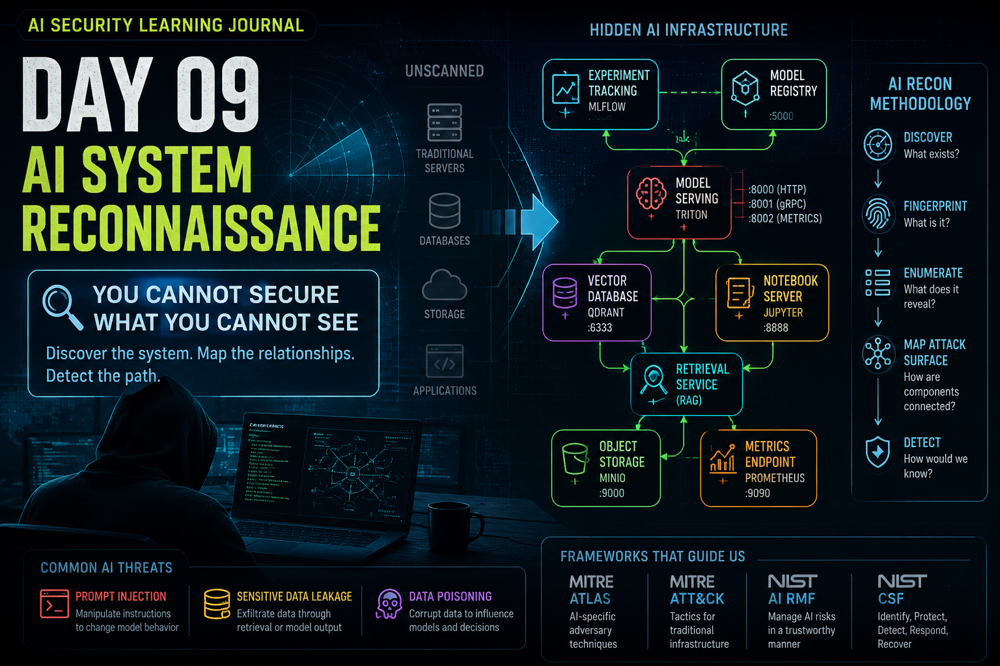

# Dia 09 — Reconhecimento de Sistemas de IA

<p align="center">
  
</p>

> Você não pode modelar ameaças de maneira eficaz em um sistema de IA que não consegue ver, nem proteger um sistema de IA protegendo apenas o modelo.

## Visão Geral

**Tempo de leitura:** cerca de 27 minutos

Esta publicação conecta o reconhecimento de IA à modelagem de ameaças e à detecção de Blue Team por meio do mapeamento de componentes implantados, metadados, relacionamentos e possíveis caminhos de ataque.

**Principais aprendizados:**

- Descoberta, fingerprinting, enumeração, exposição e exploração são constatações diferentes.
- Relacionamentos entre componentes individualmente seguros ainda podem criar caminhos de ataque inseguros.
- O reconhecimento deve atualizar continuamente tanto o modelo de ameaças quanto o monitoramento defensivo.

**Caminho sugerido:** leia a sequência descoberta–fingerprinting–enumeração e depois avance para a metodologia estruturada e o modelo final do módulo.

**Navegação rápida:** [Pilha de infraestrutura](#entendendo-a-pilha-de-infraestrutura-de-ia) · [Reconhecimento](#reconhecimento-de-ia-é-mais-do-que-varredura-de-portas) · [Metodologia](#uma-metodologia-estruturada-de-reconhecimento-de-ia) · [Modelo final](#módulo-2--meu-modelo-final-de-segurança)

## Da Modelagem de Ameaças à Realidade

O Dia 08 mudou a forma como abordo avaliações de Segurança de IA.

Em vez de começar pelas vulnerabilidades, comecei por:

**Arquitetura → Ativos → Fluxos de Dados → Limites de Confiança → Ameaças**

O Dia 09 introduziu outra pergunta que precisa vir ainda antes:

> **A arquitetura na qual estou modelando ameaças realmente representa o que está implantado?**

Uma organização pode descrever sua aplicação de IA assim:

```text
Usuário
  ↓
Aplicação
  ↓
LLM
```

Mas a infraestrutura que de fato sustenta essa aplicação pode incluir:

```text
Usuário
  ↓
Aplicação / API
  ↓
LLM
  ↓
Recuperação
  ↓
Banco de Dados Vetorial


Engenharia de Dados / ML
        │
        ├── Notebooks
        │
        ├── Rastreamento de Experimentos
        │
        ├── Registro de Modelos
        │
        └── Armazenamento de Artefatos
                   ↓
             Servidor de Modelos
```

Essa diferença importa.

A modelagem de ameaças me diz o que pode dar errado com o sistema que **acredito** existir.

O reconhecimento me ajuda a entender o que **realmente existe**.

Essa se tornou a lição central do Dia 09.

---

## Você Não Pode Proteger o Que Não Consegue Ver

A visibilidade de ativos já é fundamental na cibersegurança tradicional.

A IA amplia esse problema.

A implantação de recursos de IA pode introduzir infraestruturas como:

* endpoints de servidores de modelos;
* plataformas de rastreamento de experimentos;
* registros de modelos;
* bancos de dados vetoriais;
* ambientes de notebooks;
* repositórios de artefatos;
* armazenamento de objetos;
* plataformas de orquestração;
* interfaces de monitoramento;
* APIs internas;
* dependências de modelos externos.

Esses componentes podem ser introduzidos por equipes diferentes.

Alguns podem começar como infraestrutura experimental.

Alguns podem depois se tornar dependências de produção.

Alguns podem ser implantados com configurações padrão convenientes para desenvolvedores que nunca foram revistas.

A questão de segurança, portanto, torna-se maior do que:

> **Nosso chatbot é seguro?**

Também preciso perguntar:

> **Conhecemos todos os componentes que participam do ciclo de vida da IA, o que eles expõem, como se comunicam e quais relações de confiança os conectam?**

A Segurança de IA torna-se, portanto, tanto um **problema de visibilidade de ativos** quanto um problema de segurança de aplicações.

---

## A IA Acrescenta Infraestrutura — Ela Não Substitui a Infraestrutura Tradicional

Ambientes tradicionais já contêm:

```text
Sistemas Operacionais
Redes
Aplicações Web
APIs
Bancos de Dados
Infraestrutura em Nuvem
Sistemas de Identidade
Monitoramento
Armazenamento
```

A IA acrescenta outra camada:

```text
Infraestrutura Tradicional
          +
Infraestrutura de IA
          │
          ├── Servidor de Modelos
          ├── Rastreamento de Experimentos
          ├── Registros de Modelos
          ├── Bancos de Dados Vetoriais
          ├── Notebooks
          ├── Armazenamento de Artefatos
          ├── Pipelines de Treinamento
          ├── Métricas
          ├── APIs de IA
          └── Modelos Externos
```

A palavra importante é:

> **Acrescenta.**

Uma aplicação moderna de IA herda os riscos tradicionais de cibersegurança enquanto introduz riscos adicionais em todo o ciclo de vida de IA/ML.

---

## O Modelo É Apenas Um Ativo

Antes deste módulo, teria sido fácil concentrar a atenção em:

```text
Usuário
 ↓
LLM
 ↓
Resposta
```

Mas o reconhecimento deixa evidente que o LLM pode ser apenas uma parte visível de um sistema muito maior.

Por exemplo:

```text
                        ┌──────────────┐
                        │   Usuário    │
                        └──────┬───────┘
                               ↓
                        ┌──────────────┐
                        │   Aplicação  │
                        └──────┬───────┘
                               ↓
                        ┌──────────────┐
                        │     LLM      │
                        └──────┬───────┘
                               ↓
                        ┌──────────────┐
                        │     RAG      │
                        └──────┬───────┘
                               ↓
                        ┌──────────────┐
                        │ Armaz. Vetor.│
                        └──────────────┘


┌──────────────┐
│   Notebook   │
└──────┬───────┘
       ↓
┌──────────────┐
│ Experimentos/│
│ Rastreamento │
└──────┬───────┘
       ↓
┌──────────────┐
│ Registro de  │
│   Modelos    │
└──────┬───────┘
       ↓
┌──────────────┐
│ Armazenam. de│
│   Artefatos  │
└──────┬───────┘
       ↓
┌──────────────┐
│Servidor de   │
│Modelos       │
└──────────────┘
```

Cada componente cria outro possível limite de segurança.

Cada relacionamento cria outra relação de confiança.

Cada novo serviço pode produzir telemetria, metadados, credenciais, APIs, permissões ou caminhos para outro sistema.

---

## Entendendo a Pilha de Infraestrutura de IA

Uma das partes mais úteis deste Dia foi aprender como um ambiente de IA pode realmente aparecer em uma rede.

O objetivo não era memorizar produtos.

O objetivo era entender os **papéis** que esses produtos desempenham.

---

## Servidor de Modelos

Depois que um modelo é treinado, algo precisa carregá-lo e responder às solicitações de inferência.

Isso cria uma camada de servidor de modelos.

Uma plataforma de serving pode expor:

```text
APIs de Inferência
Metadados do Modelo
Endpoints de Integridade
Interfaces de Gerenciamento
Métricas
Serviços gRPC
Configuração
```

Isso significa que encontrar um servidor de modelos pode revelar muito mais do que:

> **Há um modelo de IA aqui.**

Pode ajudar a revelar:

> **Como a organização implanta e opera seus modelos de IA.**

Da perspectiva defensiva, isso significa que o servidor de modelos é ao mesmo tempo:

**uma interface de aplicação**

e

**um ativo de infraestrutura**.

---

## Rastreamento de Experimentos

O aprendizado de máquina envolve experimentação.

As equipes ajustam repetidamente:

* parâmetros;
* conjuntos de dados;
* arquitetura do modelo;
* configuração de treinamento;
* critérios de avaliação.

Plataformas de rastreamento de experimentos preservam esse histórico.

Elas podem conter informações sobre:

```text
Experimentos
   ↓
Execuções
   ↓
Parâmetros
   ↓
Métricas
   ↓
Tags
   ↓
Artefatos
```

Essas informações podem ter valor operacional.

Mas, da perspectiva do reconhecimento, também podem revelar como a organização constrói seus sistemas de IA.

---

## Registros de Modelos

Os registros de modelos são especialmente interessantes porque dão visibilidade ao ciclo de vida do modelo.

Eles podem conter:

```text
Nomes de Modelos
Versões
Estágios do Ciclo de Vida
Timestamps de Criação
Colaboradores
IDs de Execução
Locais de Artefatos
Metadados do Modelo
```

Um registro pode, portanto, tornar-se:

> **Um mapa do portfólio de produtos de ML da organização.**

É por isso que um registro pode ser extremamente valioso durante uma avaliação de segurança autorizada, mesmo que nenhuma vulnerabilidade de software seja descoberta.

---

## Bancos de Dados Vetoriais

Arquiteturas RAG dependem muito de recuperação.

Um fluxo simplificado é:

```text
Pergunta
   ↓
Embedding
   ↓
Busca Vetorial
   ↓
Contexto Relevante
   ↓
LLM
   ↓
Resposta
```

O banco de dados vetorial pode, portanto, revelar informações sobre:

* coleções indexadas;
* categorias de documentos;
* dimensões dos vetores;
* configuração de embeddings;
* metadados;
* organização dos dados.

A lição conceitual mais importante para mim é:

> **O LLM não é necessariamente o limite de conhecimento do sistema.**

A camada de recuperação pode fornecer informações que o modelo subjacente nunca conteve.

---

## Notebooks

Ambientes de notebooks são extremamente úteis para:

* experimentação;
* depuração;
* análise de dados;
* desenvolvimento de modelos;
* testes de pipelines.

Essa flexibilidade também significa que eles frequentemente se comunicam com vários componentes de IA.

Conceitualmente:

```text
Notebook
  │
  ├── Conjunto de Dados
  ├── Registro de Modelos
  ├── Banco de Dados Vetorial
  ├── Rastreador de Experimentos
  ├── Armazenamento de Objetos
  └── Fonte Externa de Modelos
```

Um notebook pode, portanto, tornar-se uma ponte entre partes que, de outro modo, estariam separadas em um ambiente de IA.

Uma das lições arquiteturais mais importantes do treinamento foi:

> **A conveniência do desenvolvedor pode se transformar involuntariamente em conectividade de infraestrutura.**

Isso é particularmente importante quando os ambientes de desenvolvimento contêm:

* caminhos internos;
* relacionamentos entre serviços;
* credenciais;
* tokens;
* configuração.

---

## Armazenamento de Modelos e Artefatos

Os modelos precisam, em última instância, ser armazenados em algum lugar.

O próprio modelo pode existir como artefatos serializados em:

```text
Armazenamento de Objetos
Buckets em Nuvem
Repositórios Internos
Registros de Modelos
Armazenamentos de Artefatos
```

Isso nos apresenta um problema conhecido da tríade CIA.

### Confidencialidade

Alguém consegue obter o modelo?

### Integridade

Alguém consegue substituir ou modificar o modelo?

### Disponibilidade

Alguém consegue impedir a organização de recuperar ou implantar o modelo?

Os princípios tradicionais de segurança continuam válidos.

O ativo mudou.

---

## Métricas e Observabilidade

As métricas existem para ajudar defensores e operadores a entender um sistema.

Mas a telemetria exposta também pode se tornar inteligência de reconhecimento.

Dependendo do ambiente, as métricas podem revelar informações como:

* identificadores de modelos;
* versões de modelos;
* atividade de inferência;
* utilização de recursos;
* uso de GPU;
* tamanho de lote;
* comportamento de implantação;
* latência;
* topologia.

Isso me trouxe outro princípio útil:

> **A visibilidade operacional dos defensores pode se tornar visibilidade de reconhecimento para atacantes quando exposta além do limite de confiança errado.**

---

## Reconhecimento de IA É Mais do Que Varredura de Portas

Um dos conceitos que inicialmente precisei refinar foi a diferença entre:

```text
Descoberta
Fingerprinting
Enumeração
```

Esses estágios estão relacionados.

Mas respondem a perguntas diferentes.

---

## Descoberta — O Que Existe?

A descoberta pergunta:

> **O que está em execução?**

Nesse estágio, identifico sistemas e serviços expostos.

Conceitualmente:

```text
Rede
   ↓
Host
   ↓
Serviço Aberto
```

Isso me diz que algo existe.

Mas talvez não diga exatamente o que é.

É por isso que apenas a descoberta não basta.

---

## Fingerprinting — O Que É Exatamente?

O fingerprinting pergunta:

> **Qual tecnologia ou framework está por trás deste serviço?**

Imagine que a descoberta inicial identifique apenas:

```text
HTTP
```

Isso me diz muito pouco.

O próximo estágio pergunta:

```text
Que tipo de serviço HTTP é este?
```

O treinamento mostrou várias categorias de evidências que podem ajudar a responder a essa pergunta.

---

## Cabeçalhos HTTP

Os cabeçalhos de resposta podem revelar:

* runtime;
* framework;
* implementação do servidor;
* marcadores específicos do produto.

Um serviço HTTP genérico pode, portanto, começar a revelar sua identidade por meio de metadados aparentemente comuns.

---

## Estrutura da Resposta JSON

Serviços diferentes costumam retornar estruturas de resposta características.

Para o reconhecimento, importam aspectos como:

```text
Nomes de campos
Estrutura dos objetos
Identificadores de modelos
Metadados de versão
Informações da plataforma
```

A própria estrutura pode se tornar uma impressão digital.

---

## Nomenclatura de Endpoints

Aplicações tradicionais frequentemente usam nomes de recursos:

```text
/users
/accounts
/products
```

Serviços de IA frequentemente expõem conceitos relacionados a:

```text
/models
/inference
/generate
/embeddings
/health
/metrics
/collections
/experiments
```

A nomenclatura dos endpoints pode, portanto, revelar que uma aplicação realiza algo específico de IA mesmo antes de o produto ser totalmente identificado.

---

## Comportamento de Erro

Esta foi outra lição interessante.

Um erro nem sempre é inútil.

Mensagens de erro detalhadas podem revelar:

* estruturas de dados esperadas;
* terminologia específica do framework;
* nomes de bibliotecas internas;
* formatos de tensores;
* tipos esperados;
* caminhos;
* suposições de configuração.

Isso significa:

> **O comportamento em caso de falha pode se tornar dado de fingerprinting.**

É por isso que sistemas de produção devem evitar respostas de diagnóstico desnecessariamente detalhadas através de limites não confiáveis.

---

## Comportamento do Protocolo

A infraestrutura de IA nem sempre usa APIs REST comuns.

Alguns serviços de IA usam protocolos como gRPC.

Isso significa que uma avaliação precisa considerar que:

```text
Scanner HTTP
      ≠
Descoberta Completa de Serviços de IA
```

Um serviço pode estar perfeitamente visível para a aplicação e, ainda assim, ser mal caracterizado pelo reconhecimento tradicional limitado a HTTP.

---

## Fingerprinting É Identificação, Não Exploração

Essa distinção se tornou importante durante o teste de conhecimento.

Se eu identificar:

> **Este serviço parece ser um framework específico de IA**

isso não significa necessariamente que explorei algo.

Identifiquei um componente.

Portanto:

```text
Descoberta
≠
Exploração

Fingerprinting
≠
Exploração
```

A precisão da terminologia importa.

---

## Enumeração — O Que o Serviço Revela?

A enumeração avança mais um estágio.

Ela pergunta:

> **Quais informações este componente está disposto a me fornecer?**

Por exemplo:

```text
Descoberta:
"Há um serviço de gerenciamento de modelos."

Fingerprinting:
"Este parece ser uma plataforma específica de gerenciamento de modelos."

Enumeração:
"Estes são os modelos, versões, experimentos, artefatos e relacionamentos que ele expõe."
```

Essa é uma mudança significativa.

---

## Metadados São Inteligência

Um conceito que quero guardar deste Dia é:

> **Metadados podem se tornar inteligência de segurança.**

Uma única resposta de API pode revelar informações sobre:

* nomes de modelos;
* nomes de experimentos;
* versões;
* colaboradores;
* locais de artefatos;
* ambientes de implantação;
* histórico de treinamento;
* relacionamentos de origem.

Nenhuma dessas informações isoladamente representa necessariamente um comprometimento.

Mas, juntas, podem revelar a forma do ambiente de IA.

---

## A Enumeração Pode Revelar Relacionamentos

É aqui que o reconhecimento se transforma em reconstrução da arquitetura.

Suponha que a enumeração revele:

```text
Experimento
   ↓
Modelo
   ↓
Versão
   ↓
Local do Artefato
```

Agora um serviço aponta para outro sistema.

Isso transforma o reconhecimento de:

```text
Encontrar serviço individual
```

em:

```text
Entender os relacionamentos entre serviços
```

E é nos relacionamentos que os caminhos de ataque começam a surgir.

---

## Das Constatações a Um Mapa da Superfície de Ataque

Uma lista de serviços é útil.

Um mapa conectado é muito mais valioso.

Imagine descobrir:

```text
Notebook

Rastreador de Experimentos

Registro de Modelos

Armazenamento de Artefatos
```

Individualmente, são quatro constatações.

Mas suponha que o reconhecimento mostre:

```text
Notebook
   ↓
Rastreador de Experimentos
   ↓
Registro de Modelos
   ↓
Armazenamento de Artefatos
```

Agora a questão de segurança muda.

Já não pergunto apenas:

> **Cada componente é vulnerável?**

Também preciso perguntar:

> **Que confiança existe entre esses componentes?**

---

## Relações de Confiança Importam Mais do Que Produtos Individuais

Esta se tornou uma das lições mais marcantes do Dia 09.

Imagine que todos os quatro componentes estejam:

* atualizados;
* com patches aplicados;
* livres de CVEs críticas conhecidas.

O sistema ainda pode conter um caminho de ataque perigoso.

Por quê?

Porque relacionamentos introduzem riscos por meio de:

```text
Credenciais
Permissões
Limites de Autenticação
Exposição de Rede
Configuração
Metadados
Armazenamento Compartilhado
Confiança Implícita
Identidades com Privilégios Excessivos
```

Cada relacionamento pode ser legítimo.

Juntos, podem formar um caminho pelo ambiente.

---

## Um Componente Seguro Não Garante Um Sistema Seguro

Esta é provavelmente uma das minhas conclusões favoritas do Dia:

> **Um componente seguro não cria necessariamente um sistema seguro. Relações de confiança entre componentes individualmente seguros podem formar um caminho de ataque crítico.**

Isso se conecta diretamente ao Dia 06:

> **Um modelo seguro conectado a uma arquitetura insegura ainda resulta em um sistema inseguro.**

Mas o Dia 09 torna a ideia ainda mais operacional:

> **Os produtos individuais podem ser seguros enquanto os relacionamentos entre eles criam o risco.**

---

## Encadeamento de Caminhos de Ataque

Meu modelo mental tornou-se:

```text
Descoberta Inicial
       ↓
Identificação do Serviço
       ↓
Metadados
       ↓
Descoberta de Relacionamentos
       ↓
Credenciais / Permissões
       ↓
Pivô Autenticado
       ↓
Outro Componente de IA
       ↓
Possível Acesso a Ativo de Maior Valor
```

Isso não significa que toda constatação de reconhecimento resulte em comprometimento.

Significa que as constatações ajudam a identificar:

> **possíveis caminhos de progressão que precisam ser validados.**

Essa distinção é importante.

---

## Caminho de Ataque Potencial ≠ Caminho de Ataque Confirmado

Uma das lições de terminologia que quero reter é:

```text
Caminho Potencial
      ≠
Capacidade Confirmada
```

Encontrar o local de um artefato não prova que posso gravar nele.

Encontrar uma credencial não prova automaticamente que ela tem permissões úteis.

Encontrar uma interface de gerenciamento não prova automaticamente que ela pode ser abusada.

A próxima pergunta sempre precisa ser:

> **O que as permissões realmente permitem?**

Isso importa enormemente tanto na modelagem de ameaças quanto em DFIR.

---

## Exposição Não É Vulnerabilidade

Também passei a ter mais cuidado com estas distinções:

```text
Exposição
    ≠
Vulnerabilidade

Vulnerabilidade
    ≠
Exploração

Exploração
    ≠
Comprometimento

Reconhecimento
    ≠
Comprometimento
```

Um serviço pode estar exposto intencionalmente e protegido corretamente.

Uma vulnerabilidade pode existir sem ser explorada.

O reconhecimento pode ocorrer sem exploração bem-sucedida.

E a enumeração não significa automaticamente comprometimento.

Esses termos descrevem estados diferentes.

---

## Por Que a Terminologia Importa

Em um relatório de segurança, dizer:

> **O atacante comprometeu a plataforma de ML**

significa algo muito diferente de:

> **O atacante enumerou a plataforma de ML.**

As evidências necessárias para sustentar essas conclusões são diferentes.

À medida que avanço no trabalho de segurança e DFIR, essa precisão se torna cada vez mais importante.

---

## Seguindo o Ciclo de Vida da IA

Uma maneira útil de mapear constatações de reconhecimento é acompanhar o próprio ciclo de vida da IA.

```text
DADOS
 ↓
INGESTÃO
 ↓
TREINAMENTO / EXPERIMENTAÇÃO
 ↓
MODELO
 ↓
REGISTRO
 ↓
ARMAZENAMENTO DE ARTEFATOS
 ↓
IMPLANTAÇÃO
 ↓
INFERÊNCIA
 ↓
RECUPERAÇÃO
 ↓
SAÍDA
```

Cada transição cria outra pergunta.

---

## Dados e Ingestão

Quero saber:

* De onde vêm os dados?
* Quem pode modificá-los?
* A proveniência é conhecida?
* Que validação ocorre antes da ingestão?
* Fontes externas podem fornecer conteúdo?

Isso se conecta diretamente às ameaças de envenenamento.

---

## Treinamento e Experimentação

As perguntas incluem:

* Quem pode iniciar o treinamento?
* Quais conjuntos de dados são usados?
* Onde os resultados são armazenados?
* Quais identidades controlam o pipeline?
* Quais dependências estão envolvidas?

A infraestrutura de treinamento, portanto, faz parte da superfície de ataque.

---

## Registro de Modelos

As perguntas incluem:

* Qual modelo é o oficial?
* Quem pode registrar uma versão?
* Quem pode promovê-la?
* Onde está o artefato?
* Como a integridade é validada?
* A proveniência está documentada?

O registro torna-se um limite de confiança crítico entre:

```text
Treinamento
   ↓
Modelo Aprovado
   ↓
Produção
```

---

## Implantação e Inferência

Quero entender:

* Qual interface expõe o modelo?
* Quem pode invocá-lo?
* Quais metadados são expostos?
* A funcionalidade de gerenciamento está acessível?
* Quais outros serviços se comunicam com a camada de inferência?

A inferência é tanto uma função do produto quanto uma função da infraestrutura.

---

## Recuperação

Para sistemas RAG:

```text
Quem controla os dados?

Quem pode inserir conteúdo?

Quem pode recuperar qual conteúdo?

As permissões são aplicadas antes da recuperação?

Conteúdo controlado pelo atacante pode se tornar contexto do modelo?
```

A camada de recuperação cria uma ponte entre o armazenamento e o comportamento do modelo.

---

## Saída

Por fim:

* O que pode sair do sistema?
* Contexto sensível pode chegar à resposta?
* A saída é validada?
* Sistemas posteriores podem executar o conteúdo gerado?
* A identidade solicitante está autorizada a acessar os dados subjacentes?

Somente a filtragem de entrada não basta.

---

## Reconhecimento de IA da Perspectiva do Blue Team

Uma das partes mais úteis deste Dia foi inverter a perspectiva.

Tudo o que um avaliador autorizado faz durante o reconhecimento gera telemetria.

Isso significa que o mesmo conhecimento pode ser usado defensivamente.

Conceitualmente:

```text
Red Team / Avaliador
       ↓
Descoberta
       ↓
Fingerprinting
       ↓
Enumeração
       ↓
Mapeamento da Superfície de Ataque
```

torna-se:

```text
Blue Team
       ↓
Detectar Descoberta
       ↓
Detectar Fingerprinting
       ↓
Detectar Enumeração
       ↓
Correlacionar Comportamentos
```

Essa foi uma conexão particularmente útil para mim porque une a compreensão ofensiva à detecção do Blue Team.

---

## Detectando Varreduras Conscientes de IA

Nem toda varredura tem o mesmo significado.

Imagine uma única origem sondando sistematicamente uma coleção de serviços normalmente associados à infraestrutura de IA/ML.

Isso pode indicar:

> **reconhecimento consciente de IA**

em vez de uma varredura genérica.

A sequência importa.

```text
Origem
  ↓
Serviço de IA
  ↓
Outro Serviço de IA
  ↓
Outro Serviço de IA
```

Um padrão pode revelar a intenção com mais clareza do que um evento isolado.

---

## Detectando Fingerprinting

Suponha que uma origem primeiro realize uma descoberta ampla.

Imediatamente depois, começa a fazer solicitações específicas de um framework.

Conceitualmente:

```text
Varredura Genérica
    ↓
Serviço Encontrado
    ↓
Sondagem de Endpoint Específico
    ↓
Solicitações Malformadas / de Identificação
```

Agora o comportamento mudou de:

> **O que existe?**

para:

> **O que exatamente encontrei?**

Essa transição, por si só, pode ser um contexto valioso para detecção.

---

## Detectando Enumeração

A enumeração pode aparecer como rajadas de solicitações por:

```text
Modelos
Versões
Experimentos
Configurações
Métricas
Coleções
Artefatos
Notebooks
```

Uma aplicação legítima pode acessar alguns desses recursos.

Portanto, uma única solicitação pode não ser suficiente.

A sequência mais ampla importa.

---

## O Contexto Separa a Automação Legítima do Reconhecimento

Ambientes de IA contêm naturalmente muita automação.

Por exemplo:

```text
Notebook → Rastreador de Experimentos

Monitoramento → Endpoint de Métricas

Aplicação → Servidor de Inferência
```

Isso é normal.

Portanto, um defensor precisa de contexto.

As perguntas incluem:

* Esta é a origem esperada?
* A identidade é esperada?
* A solicitação tem a sessão esperada?
* A frequência é normal?
* Houve uma varredura antes?
* Este endpoint normalmente é acessado por este sistema?
* A sequência é compatível com operações normais de ML?

Isso é detecção comportamental.

---

## Nem Todo Log É Malicioso

Isso foi reforçado com ênfase na atividade prática de Blue Team.

Uma solicitação que parece técnica ou automatizada não é automaticamente hostil.

Por exemplo:

```text
Pipeline de ML Conhecido
      ↓
API de ML Esperada
      ↓
User-Agent Esperado
      ↓
Horário Esperado
```

pode ser simplesmente uma atividade legítima de aprendizado de máquina.

Isso reforça um princípio importante de SOC:

> **A detecção exige contexto, não apenas correspondência de padrões.**

---

## Reconhecimento Não É Comprometimento — Mas Importa

Imagine observar:

```text
Varredura
   ↓
Fingerprinting
   ↓
Enumeração
   ↓
Descoberta de Relacionamentos
   ↓
Tentativa de Pivô
```

Ainda pode não haver:

* malware;
* RCE;
* exfiltração de dados;
* ação destrutiva.

Mas o comportamento ainda importa.

Ele demonstra:

* intenção;
* aquisição de conhecimento;
* seleção de alvo;
* progressão.

Portanto:

> **Reconhecimento não é comprometimento, mas o reconhecimento direcionado pode representar preparação para o comprometimento.**

É por isso que eu investigaria uma sequência coerente antes de esperar pela exploração.

---

## Transformando Conhecimento de Red Team em Detecção de Blue Team

Outra lição importante do Dia 09 é que compreender a metodologia do atacante ajuda a construir uma detecção melhor.

Se sei que o reconhecimento normalmente progride por:

```text
Descoberta
   ↓
Fingerprinting
   ↓
Enumeração
```

posso procurar as sequências correspondentes na telemetria.

Por exemplo:

```text
Varredura Ampla de Portas de IA
        ↓
Sondagem Específica do Framework
        ↓
Solicitações de Metadados
        ↓
Acesso a Outro Serviço Relacionado
```

Cada evento isoladamente pode parecer de baixa gravidade.

Juntos, eles contam uma história.

---

## Do Reconhecimento de Volta à Modelagem de Ameaças

Os Dias 08 e 09 formam um ciclo.

Dia 08:

> **Modele as ameaças contra a arquitetura.**

Dia 09:

> **Verifique se a arquitetura realmente existe conforme documentada.**

Então:

```text
Reconhecimento
      ↓
Descoberta de Ativos
      ↓
Atualização da Arquitetura
      ↓
Atualização do Modelo de Ameaças
      ↓
Avaliação de Riscos
      ↓
Controles
      ↓
Detecção
      ↓
Reavaliação
```

Isso é muito mais sólido do que executar reconhecimento e modelagem de ameaças como atividades sem relação entre si.

---

## A Lacuna de Documentação É Uma Lacuna de Segurança

Imagine:

### Equipe A

Tem um excelente modelo de ameaças.

Ele contém:

* ativos;
* limites de confiança;
* STRIDE;
* ATLAS;
* OWASP;
* mitigações.

### Equipe B

Realiza reconhecimento autorizado e descobre vários serviços de IA ausentes dessa documentação.

Qual visão representa o risco real?

A resposta é:

> **A arquitetura precisa ser reconciliada com a realidade.**

Um modelo de ameaças perfeito de um ambiente incompleto ainda é incompleto.

---

## Modele as Ameaças do Que Realmente Existe

O processo correto torna-se:

```text
Descoberta no Mundo Real
        ↓
Inventário de Ativos
        ↓
Atualização da Arquitetura
        ↓
Atualização do Fluxo de Dados
        ↓
Atualização dos Limites de Confiança
        ↓
Atualização do Modelo de Ameaças
        ↓
Reavaliação de Riscos
```

Não descarto o modelo de ameaças existente.

Eu o torno mais preciso.

---

## A Cadeia de Suprimentos Também Faz Parte do Reconhecimento

Sistemas de IA frequentemente dependem muito de recursos externos.

Os exemplos incluem:

* repositórios públicos de modelos;
* modelos-base de terceiros;
* conjuntos de dados externos;
* pacotes;
* imagens de contêineres;
* serviços em nuvem;
* hubs de modelos.

Isso significa que o reconhecimento também deve perguntar:

> **Em que este ambiente de IA confia que a organização não controla diretamente?**

Isso conecta diretamente o Dia 09 à segurança da cadeia de suprimentos.

---

## Modelos Externos São Dependências

Se um sistema baixa um modelo de uma fonte externa, essa fonte passa a fazer parte da cadeia de confiança.

Conceitualmente:

```text
Repositório Externo
      ↓
Modelo-Base
      ↓
Pipeline Interno
      ↓
Ajuste Fino
      ↓
Modelo Interno
      ↓
Produção
```

Um comprometimento upstream pode acabar afetando a produção.

Portanto, compreender a proveniência importa até durante o reconhecimento.

---

## Credenciais Conectam Cadeias de Suprimentos

Tokens de acesso e credenciais podem conectar sistemas internos a plataformas externas de IA.

Da perspectiva de segurança, essas credenciais precisam de:

* escopo mínimo;
* rotação;
* armazenamento adequado;
* monitoramento;
* gerenciamento do ciclo de vida.

Mais uma vez, o privilégio mínimo continua sendo um princípio tradicional de cibersegurança aplicado a um novo tipo de dependência.

---

## Três Caminhos de Ameaça Reforçados Pela Avaliação

A Avaliação final de Modelagem de Ameaças ajudou a reforçar algo muito importante:

> **Ameaças diferentes percorrem caminhos arquiteturais diferentes.**

Portanto, os pontos de controle mais eficazes variam conforme a ameaça.

Estou intencionalmente deixando de documentar a solução do laboratório.

A lição útil é o raciocínio por trás dos cenários.

---

## Injeção de Prompt

Conceitualmente:

```text
Entrada Não Confiável
      ↓
Prompt / Contexto
      ↓
LLM
      ↓
Resposta / Ação
```

A pergunta não é apenas:

> **Alguém consegue escrever um prompt malicioso?**

Também preciso perguntar:

* O que o modelo recebe?
* Quais instruções são confiáveis?
* O que o modelo pode fazer?
* Quais ferramentas estão disponíveis?
* Quais privilégios existem por trás dessas ferramentas?
* O que acontece se a instrução funcionar?

O impacto da Injeção de Prompt depende muito da arquitetura ao redor do modelo.

---

## Vazamento de Dados Sensíveis

Informações sensíveis seguem outro caminho:

```text
Dados Sensíveis
      ↓
Armazenamento
      ↓
Recuperação
      ↓
Contexto do Modelo
      ↓
Resposta
      ↓
Usuário
```

Se o usuário nunca teve autorização para ver a informação, depender do LLM para não mencioná-la já é tarde demais.

Uma arquitetura mais sólida aplica controles antes.

Por exemplo:

```text
Autorização
Classificação de Dados
Filtragem de Recuperação
Privilégio Mínimo
Minimização de Contexto
Controles de Saída
```

O princípio torna-se:

> **Não forneça ao modelo informações que a identidade solicitante nunca teve autorização para acessar.**

---

## Envenenamento de Dados

O envenenamento percorre outro caminho:

```text
Dados Maliciosos
      ↓
Fonte
      ↓
Ingestão
      ↓
Armazenamento / Índice
      ↓
Recuperação
      ↓
LLM
      ↓
Resposta Influenciada
```

Isso reforça outra distinção:

> **Dados de recuperação envenenados não significam necessariamente um modelo envenenado.**

Os pesos do modelo podem permanecer perfeitamente intactos.

O que foi corrompido é o contexto fornecido ao modelo.

---

## Proteja o Upstream Quando a Ameaça Começa no Upstream

Uma das minhas conclusões mais fortes da avaliação foi:

> **Se a ameaça começa antes do LLM, a defesa principal não deve existir apenas no LLM.**

Para Envenenamento de Dados, por exemplo, controles sólidos podem estar em:

```text
Fonte de Dados
     ↓
Ingestão
     ↓
Validação
     ↓
Proveniência
     ↓
Armazenamento
```

Esperar que informações corrompidas cheguem ao modelo significa que a defesa já se deslocou muito mais para downstream.

---

## Os Controles Devem Acompanhar o Caminho da Ameaça

A defesa em profundidade continua importante.

Mas a modelagem de ameaças exige mais precisão do que:

> **Proteja tudo.**

Quero perguntar:

```text
Onde a ameaça se origina?
        ↓
Onde ela entra?
        ↓
Quais componentes a propagam?
        ↓
Quais limites de confiança ela atravessa?
        ↓
Qual ativo é afetado?
        ↓
Onde posso interromper o caminho com mais eficiência?
```

Isso leva a outro aprendizado importante:

> **Uma modelagem eficaz de ameaças de IA não consiste em proteger igualmente todos os componentes. Consiste em entender como uma ameaça específica se propaga pela arquitetura e posicionar controles onde possam interromper esse caminho.**

---

## Uma Metodologia Estruturada de Reconhecimento de IA

O treinamento apresentou o reconhecimento como um processo repetível.

Os detalhes das ferramentas podem mudar.

A metodologia importa mais.

Atualmente, penso nela em cinco fases amplas.

---

## Fase 1 — Reconhecimento Passivo

Antes de tocar no ambiente-alvo, determine o que já está visível publicamente.

Fontes potenciais podem revelar:

* tecnologias;
* serviços públicos;
* requisitos de vagas;
* documentação pública;
* repositórios;
* imagens de contêineres;
* pesquisas publicadas;
* dependências de modelos.

O objetivo é:

> **Construir hipóteses antes de gerar tráfego ativo.**

---

## Fase 2 — Descoberta Ativa

Dentro do escopo autorizado:

> **Quais serviços relacionados à IA realmente existem?**

O objetivo é inventariar e mapear exposições.

Não explorar.

---

## Fase 3 — Fingerprinting

Para cada serviço descoberto:

> **O que ele é exatamente?**

Use comportamentos observáveis como:

* cabeçalhos;
* formatos de resposta;
* protocolos;
* convenções de endpoints;
* comportamento de erro.

---

## Fase 4 — Enumeração de Metadados

Depois de identificado:

> **O que este serviço revela sobre o ambiente de IA?**

Os exemplos incluem:

* inventário de modelos;
* metadados de implantação;
* histórico de experimentos;
* configurações;
* relacionamentos;
* referências de artefatos;
* informações de coleções.

O objetivo é entender a arquitetura.

---

## Fase 5 — Análise da Cadeia de Suprimentos

Por fim:

> **Em quais sistemas, modelos, pacotes, repositórios ou locais de armazenamento externos o ambiente confia?**

Isso amplia o reconhecimento para além da rede interna.

---

## Meu Ciclo de Vida de Avaliação de Segurança de IA

Depois dos Dias 08 e 09, meu próprio processo tornou-se mais amplo do que as cinco fases de reconhecimento.

Se hoje me pedissem para avaliar um novo ambiente de IA, eu pensaria assim:

```text
1. Descobrir
      ↓
2. Inventariar
      ↓
3. Entender a Arquitetura
      ↓
4. Mapear Fluxos de Dados
      ↓
5. Identificar Ativos
      ↓
6. Identificar Limites de Confiança
      ↓
7. Fazer Reconhecimento
      ↓
8. Fazer Fingerprinting
      ↓
9. Enumerar
      ↓
10. Construir Caminhos de Ataque
      ↓
11. Modelar Ameaças
      ↓
12. Priorizar
      ↓
13. Mitigar
      ↓
14. Detectar
      ↓
15. Reavaliar
      ↺
```

Esse é o ciclo de vida de segurança que agora faz mais sentido para mim.

---

## Mapeamento de Frameworks

Frameworks ajudam a converter observações técnicas em uma linguagem comum.

Não os vejo como a avaliação em si.

Vejo-os como formas de estruturar e comunicar o que observo.

---

## MITRE ATLAS

O ATLAS fornece comportamentos adversários específicos de IA.

Para o Dia 09, os mapeamentos conceituais importantes incluem:

* reconhecimento ativo contra sistemas de IA;
* descoberta de ativos de ML;
* descoberta de informações sobre modelos/sistemas;
* identificação de dependências da cadeia de suprimentos.

Para mim, o importante não é memorizar IDs.

É compreender:

> **O reconhecimento contra a infraestrutura de IA apresenta comportamentos adversários observáveis que podem ser descritos de modo consistente.**

Como os identificadores do framework podem evoluir com o tempo, eu verificaria os IDs atuais do ATLAS antes de usá-los em uma avaliação formal.

---

## MITRE ATT&CK

Muitas técnicas de reconhecimento de IA ainda são, em essência, técnicas tradicionais de cibersegurança.

Os exemplos incluem:

```text
Varredura de Rede
Descoberta de Serviços
Descoberta de Infraestrutura
Descoberta de Credenciais
Coleta de Informações
```

Isso reforça algo importante:

> **Segurança de IA ainda é cibersegurança.**

A IA introduz novos ativos.

Os atacantes ainda precisam interagir com redes, identidades, sistemas, APIs, armazenamento e aplicações.

---

## NIST AI RMF

O NIST AI RMF oferece outra perspectiva.

O reconhecimento sustenta a necessidade de:

* identificar componentes do sistema;
* entender interações;
* mapear dependências;
* entender riscos.

Isso se conecta fortemente à função **MAP**.

Você não pode gerenciar riscos de IA se não sabe quais sistemas de IA existem.

---

## NIST CSF

A mesma lógica é mapeada diretamente para funções tradicionais de cibersegurança, como:

**Gerenciamento de Ativos**

e

**Avaliação de Riscos**.

Ativos de IA ainda precisam ser:

* inventariados;
* classificados;
* monitorados;
* protegidos.

As categorias de ativos se expandiram.

A responsabilidade não desapareceu.

---

## Reconhecimento de IA Como Uma Capacidade de Blue Team

Uma das minhas maiores mudanças de perspectiva é que o reconhecimento não deve ser visto apenas de modo ofensivo.

As equipes de segurança podem usar o mesmo conhecimento para perguntar:

> **Saberíamos se alguém estivesse fazendo isso contra nós?**

Por exemplo:

```text
Conseguimos detectar varreduras conscientes de IA?

Conseguimos detectar enumeração de modelos sem sessão?

Conseguimos detectar acesso inesperado a métricas?

Conseguimos detectar enumeração de notebooks?

Conseguimos detectar acesso inesperado entre componentes de ML?

Conseguimos detectar mudanças nos relacionamentos normais entre serviços de IA?
```

Isso transforma o conhecimento sobre reconhecimento de IA em conhecimento de engenharia de detecção.

---

## Monitorando Relacionamentos, Não Apenas Componentes

O monitoramento tradicional pode perguntar:

```text
O serviço está em execução?
```

O monitoramento de segurança também deve perguntar:

```text
Quem está falando com o serviço?

Por quê?

De onde?

Usando qual identidade?

Em qual sequência?

Isso é normal?
```

Para ambientes de IA, monitorar relacionamentos torna-se especialmente valioso porque a infraestrutura é altamente interconectada.

---

## Detecção Comportamental

Um único evento:

```text
GET metadados do modelo
```

pode ser legítimo.

Mas:

```text
Varredura de Serviços de IA
      ↓
Fingerprinting do Framework
      ↓
Enumeração de Modelos
      ↓
Acesso a Notebook
      ↓
Solicitação de Armazenamento
```

é muito mais interessante.

A cadeia importa mais do que o evento isolado.

Isso está diretamente relacionado ao raciocínio sobre caminhos de ataque que uso em DFIR.

---

## Reconhecimento Como Uma Oportunidade de Detecção Antecipada

Se o Blue Team conseguir identificar o reconhecimento antes da exploração, a organização ganha tempo.

Isso significa que a segurança nem sempre precisa começar em:

```text
Exploit Detectado
```

Ela pode começar em:

```text
Comportamento de Descoberta Suspeito
```

Isso não significa que toda varredura seja um incidente.

Significa que o reconhecimento direcionado e correlacionado deve ser avaliado em seu contexto.

---

## O Que Mudou no Meu Pensamento Sobre Segurança

Antes do Dia 09, em minha mente, o reconhecimento poderia facilmente ser reduzido a:

> **Encontre portas abertas e identifique serviços.**

Agora vejo um processo muito mais rico:

```text
Descobrir
   ↓
Identificar
   ↓
Enumerar
   ↓
Conectar
   ↓
Entender a Confiança
   ↓
Construir Caminhos de Ataque
   ↓
Alimentar o Modelo de Ameaças
   ↓
Construir Detecção
```

Essa é uma atividade de segurança muito diferente.

---

## De Produtos a Relacionamentos

A maior mudança é que já não quero parar em:

```text
Jupyter encontrado
Plataforma de ML encontrada
Registro encontrado
Armazenamento encontrado
```

Quero entender:

```text
Jupyter
   ↓
O que ele pode alcançar?

Plataforma de ML
   ↓
O que ela revela?

Registro
   ↓
Onde estão os artefatos?

Armazenamento
   ↓
Quem pode lê-los ou modificá-los?
```

Os relacionamentos tornam-se mais importantes do que a lista de produtos.

---

## De Vulnerabilidades a Caminhos de Ataque

Outra mudança é ir além de:

> **Este serviço tem uma CVE?**

em direção a:

> **Os relacionamentos legítimos entre esses serviços poderiam criar um caminho de ataque?**

Uma CVE certamente pode criar riscos.

Mas estes itens também podem:

* ausência de autenticação;
* segmentação fraca;
* credenciais com privilégios excessivos;
* metadados expostos;
* segredos compartilhados;
* confiança excessiva.

---

## Do Reconhecimento à Detecção

Por fim, agora penso no reconhecimento pelos dois lados.

Como avaliador:

> **O que consigo descobrir?**

Como defensor:

> **Como seria a atividade de descoberta de outra pessoa na minha telemetria?**

Essa perspectiva dupla torna o exercício muito mais valioso.

---

## Encerrando o Módulo 2 — Sistemas de IA Seguros

O Dia 09 também encerra o **Módulo 2 — Sistemas de IA Seguros**.

Olhando para trás, o módulo criou uma progressão clara.

---

## Dia 06 — Protegendo Sistemas de IA

Aprendi que:

> **Um modelo seguro conectado a uma arquitetura insegura ainda resulta em um sistema inseguro.**

A segurança precisa abranger:

* arquitetura;
* limites de confiança;
* ferramentas;
* dados;
* permissões;
* saídas;
* monitoramento.

---

## Dia 07 — Segurança de LLMs

A superfície de ataque se expandiu para:

```text
DADOS
MODELO
SISTEMA
USUÁRIO
```

E aprendi:

> **Às vezes, preciso proteger a IA do atacante. Outras vezes, preciso proteger o ser humano do que o atacante pode fazer com IA.**

---

## Dia 08 — Modelagem de Ameaças de IA

Aprendi a começar antes da vulnerabilidade:

```text
Arquitetura
   ↓
Ativos
   ↓
Fluxos de Dados
   ↓
Limites de Confiança
   ↓
Ameaças
   ↓
Técnicas
   ↓
Riscos
   ↓
Mitigações
```

E desenvolvi uma metodologia de avaliação repetível.

---

## Dia 09 — Reconhecimento de Sistemas de IA

Agora acrescentei:

> **Verifique o que realmente existe.**

A modelagem de ameaças me diz como a arquitetura documentada pode falhar.

O reconhecimento me diz se essa arquitetura está completa.

---

## O Que a Avaliação Final Reforçou

A avaliação final não precisava se tornar outro Dia.

Em vez disso, reforçou os relacionamentos entre tudo o que foi aprendido no Módulo 2.

A lição mais importante não foi uma resposta específica.

Foi entender que ameaças diferentes se propagam de formas diferentes.

Por exemplo:

```text
Injeção de Prompt
      ↓
Caminho de Instrução / Contexto
```

```text
Vazamento de Dados Sensíveis
      ↓
Caminho de Acesso a Dados / Recuperação / Saída
```

```text
Envenenamento de Dados
      ↓
Caminho de Fonte de Dados / Ingestão / Recuperação
```

Cada um exige prioridades defensivas diferentes.

Isso torna a modelagem de ameaças arquitetural, e não genérica.

---

## Módulo 2 — Meu Modelo Final de Segurança

Depois de concluir o módulo, meu modelo mental é:

```text
Descobrir o que realmente existe
           ↓
Entender como funciona
           ↓
Identificar o que tem valor
           ↓
Mapear como os componentes confiam uns nos outros
           ↓
Identificar como as ameaças entram
           ↓
Entender como elas se propagam
           ↓
Interromper os caminhos de ataque importantes
           ↓
Detectar tentativas de percorrê-los
           ↓
Reavaliar continuamente
```

Isso é significativamente diferente de:

```text
Encontrar vulnerabilidade
      ↓
Corrigir vulnerabilidade
```

Sistemas de IA são interconectados demais para que isso seja suficiente.

---

## Principais Aprendizados

As principais lições que levo do Dia 09 são:

### A infraestrutura de IA pode existir fora da arquitetura de aplicação documentada.

As equipes de segurança precisam de visibilidade sobre o que realmente está implantado.

### Descoberta, fingerprinting e enumeração são atividades diferentes.

Elas respondem:

```text
O que existe?
O que é exatamente?
O que revela?
```

### Metadados podem revelar a arquitetura.

Um serviço não precisa ser explorado para fornecer inteligência relevante.

### Um componente seguro não garante um sistema seguro.

Relações de confiança podem criar caminhos de ataque entre componentes que, de outro modo, estariam bem protegidos.

### Reconhecimento não é exploração.

Terminologia precisa importa.

### Caminhos de ataque potenciais precisam de validação.

Encontrar um relacionamento não prova que existam as permissões necessárias para abusar dele.

### O reconhecimento de IA também pertence ao Blue Team.

A mesma metodologia cria padrões identificáveis nos logs.

### A modelagem de ameaças e o reconhecimento devem se atualizar continuamente.

Um modelo de ameaças só é útil se refletir a realidade.

### Ameaças diferentes exigem controles em locais diferentes.

Os controles de segurança devem acompanhar o caminho da ameaça.

### Segurança de IA ainda é cibersegurança.

Conceitos tradicionais como CIA, privilégio mínimo, identidade, segmentação, monitoramento e segurança da cadeia de suprimentos continuam válidos.

---

## Meu Maior Aprendizado

Se eu tivesse que resumir o Dia 09 em uma ideia:

> **O reconhecimento elimina a lacuna entre a arquitetura de IA que uma organização acredita ter e a infraestrutura de IA que está realmente implantada.**

E o princípio que quero levar adiante é:

> **Você não pode modelar ameaças de maneira eficaz em um sistema de IA que não consegue ver, nem proteger um sistema de IA protegendo apenas o modelo.**

O modelo é apenas um componente.

A verdadeira Segurança de IA exige visibilidade sobre:

```text
Dados
Modelos
Infraestrutura
Recuperação
Armazenamento
Identidade
Pipelines
Dependências
APIs
Pessoas
Relações de Confiança
```

É isso que transforma componentes isolados de IA em um sistema.

E é o sistema que precisa ser protegido.

---

## Próximos Passos

O Módulo 2 está concluído.

A próxima etapa da jornada avança para **Segurança de Prompts**, na qual o foco se aprofundará em ataques e defesas envolvendo a camada de instruções em linguagem natural das aplicações com LLMs.

O processo continua sendo:

**Aprender → Questionar → Entender → Aplicar → Compartilhar**

---

## Referências

- [MITRE — ATLAS](https://atlas.mitre.org/)
- [MITRE — ATT&CK](https://attack.mitre.org/)
- [NIST — Cybersecurity Framework 2.0](https://www.nist.gov/cyberframework)
- [OWASP — Web Security Testing Guide](https://owasp.org/www-project-web-security-testing-guide/)

---

## Sobre Este Diário de Aprendizado

Este repositório documenta minha jornada pessoal de aprendizado e minhas reflexões durante os estudos sobre Segurança de IA.

A trilha de aprendizado é inspirada nos meus estudos com o **material de Segurança de IA da TryHackMe**, combinados com minha experiência anterior em cibersegurança e gerenciamento de incidentes.

As explicações, analogias, exemplos e conclusões apresentados aqui representam meu próprio entendimento e minhas reflexões.

Este repositório não reproduz laboratórios, perguntas, soluções, flags, credenciais, respostas de avaliações nem conteúdo proprietário de cursos da TryHackMe.

**Aprender → Questionar → Entender → Aplicar → Compartilhar**
