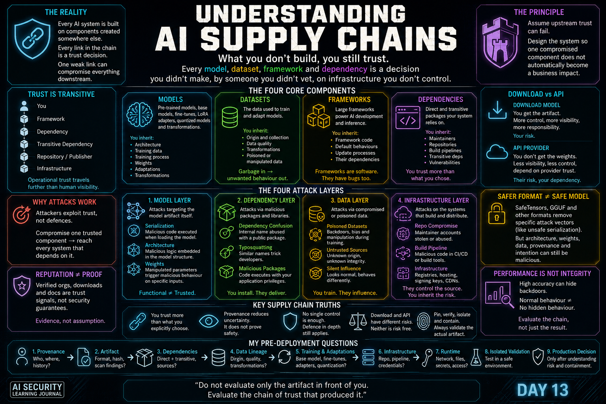

# Dia 13 — Entendendo a Cadeia de Suprimentos de IA

<p align="center">
  
</p>

> A segurança da cadeia de suprimentos de IA começa pela identificação de cada componente externo e cada relação em que se deve confiar antes que um sistema possa operar.

## Visão Geral

**Tempo de leitura:** cerca de 24 minutos

Esta publicação mapeia os modelos, conjuntos de dados, bibliotecas, repositórios, infraestrutura e provedores que compõem uma cadeia de suprimentos de IA.

**Principais aprendizados:**

- Um modelo é um artefato dentro de um grafo maior de dependências e confiança.
- A proveniência deve descrever origem, propriedade, transformações e custódia.
- A confiança deve se basear em evidências, ter escopo definido e ser reavaliada continuamente.

**Caminho sugerido:** acompanhe primeiro o mapa de dependências e depois use as seções sobre proveniência e confiança contínua para avaliar um sistema real.

**Navegação rápida:** [Quatro componentes principais](#os-quatro-componentes-principais) · [A confiança é transitiva](#a-confiança-é-transitiva) · [Proveniência](#a-proveniência-torna-se-uma-propriedade-de-segurança) · [Perguntas antes da implantação](#minhas-perguntas-de-segurança-antes-da-implantação)

## Diário de Aprendizado em Segurança de IA

Hoje comecei o **Módulo 4 — Segurança da Cadeia de Suprimentos de IA**.

Até agora, grande parte da minha jornada de aprendizado se concentrou no que pode acontecer depois que um sistema de IA passa a existir: arquiteturas inseguras, Prompt Injection, Jailbreaking, capacidades excessivas, saídas inseguras e falhas entre fronteiras de confiança.

Este tópico levou a investigação mais para o início da cadeia.

Em vez de perguntar apenas:

> **Como este sistema de IA pode ser atacado?**

Comecei a perguntar:

> **Em que foi preciso confiar antes mesmo que este sistema de IA pudesse existir?**

Um sistema de IA em produção raramente começa com componentes criados inteiramente pela organização que o implanta.

Os modelos podem vir de repositórios públicos.

Os conjuntos de dados podem vir de terceiros.

Os frameworks podem conter centenas de milhares de linhas de código.

Os pacotes podem introduzir dependências que nunca selecionei diretamente.

Um modelo-base pode ter sido treinado por uma organização, adaptado por outra, quantizado por outra pessoa, distribuído por outra plataforma e, por fim, baixado para minha infraestrutura.

Cada etapa cria uma relação de confiança.

E cada relação de confiança cria parte da superfície de ataque.

Meu primeiro grande aprendizado com este tópico é:

> **Um modelo que funciona comprova funcionalidade. Ele não comprova proveniência, integridade nem confiabilidade.**

---

## Das Cadeias de Suprimentos de Software às Cadeias de Suprimentos de IA

O problema básico da cadeia de suprimentos já existe no software tradicional.

Uma aplicação moderna raramente contém apenas código escrito pela própria equipe de desenvolvimento.

Em vez disso, ela pode depender de:

```text
Aplicação
    │
    ├── Framework
    │      │
    │      ├── Dependência A
    │      │      └── Dependência Transitiva
    │      │
    │      └── Dependência B
    │
    └── Runtime
```

Quando instalo um pacote, posso implicitamente confiar em muitos outros.

Isso significa que minha decisão real de confiança é muito maior do que:

```text
Confio no Pacote A
```

Na realidade, ela pode significar:

```text
Confio no Pacote A
        ↓
Confio naquilo de que o Pacote A depende
        ↓
Confio naquilo de que essas dependências dependem
        ↓
Confio nos repositórios que as distribuem
        ↓
Confio nas identidades autorizadas a publicá-las
        ↓
Confio na infraestrutura usada para compilá-las
```

Um invasor não precisa necessariamente comprometer minha aplicação diretamente.

Se conseguir comprometer algo em que minha aplicação já confia, a cadeia de suprimentos existente poderá entregar o ataque por ele.

Esse é um dos motivos pelos quais ataques à cadeia de suprimentos podem ganhar escala com tanta eficiência.

Em vez de atacar individualmente cada vítima a jusante:

```text
Invasor
   ├── Vítima A
   ├── Vítima B
   ├── Vítima C
   └── Vítima D
```

o invasor pode atacar algo a montante:

```text
              Invasor
                  │
                  ▼
          Componente Confiável
                  │
        ┌─────────┼─────────┐
        ▼         ▼         ▼
     Vítima A  Vítima B  Vítima C
```

A relação de confiança passa a fazer parte do mecanismo de entrega.

---

## A IA Amplia a Cadeia de Suprimentos Tradicional

A IA não substitui a cadeia de suprimentos de software tradicional.

Ela a amplia.

Uma aplicação de IA ainda pode depender de sistemas operacionais, contêineres, gerenciadores de pacotes, bibliotecas, APIs, pipelines de CI/CD e infraestrutura de nuvem.

Mas agora outros artefatos entram em cena:

```text
Cadeia de Suprimentos de Software Tradicional
            +
        Modelos de IA
            +
      Dados de Treinamento
            +
      Adaptações de Modelos
            +
   Transformações de Modelos
            =
 Cadeia de Suprimentos de IA
```

Isso torna a segurança da cadeia de suprimentos de IA especialmente interessante para mim, pois um modelo não é simplesmente outra biblioteca de software.

Seu comportamento pode refletir decisões e artefatos originados muito antes em seu ciclo de vida.

Um modelo que baixo hoje pode representar o resultado de:

```text
Seleção da Arquitetura
        ↓
Conjunto de Dados de Treinamento
        ↓
Processo de Treinamento
        ↓
Modelo-Base
        ↓
Fine-Tuning
        ↓
Adaptadores
        ↓
Otimização
        ↓
Quantização
        ↓
Empacotamento
        ↓
Distribuição
        ↓
Implantação
```

Talvez eu controle apenas a etapa final.

Ainda assim, minha aplicação herda pressupostos de confiança de tudo o que vem antes dela.

---

## Os Quatro Componentes Principais

Uma forma útil de raciocinar sobre uma cadeia de suprimentos de IA é considerar quatro componentes principais:

```text
Cadeia de Suprimentos de IA
│
├── Modelos
├── Conjuntos de Dados
├── Frameworks
└── Dependências
```

Cada um gera perguntas de segurança diferentes.

---

## Modelos

Modelos pré-treinados permitem que organizações criem sistemas de IA sem treinar tudo do zero.

Isso gera enorme valor prático.

Também gera confiança herdada.

Quando utilizo um modelo criado em outro lugar, talvez esteja confiando em:

```text
Arquitetura do Modelo
        +
Dados de Treinamento
        +
Processo de Treinamento
        +
Pesos Aprendidos
        +
Fine-Tuning
        +
Adaptadores
        +
Transformações
        +
Empacotamento
```

O fato de a inferência funcionar corretamente não comprova que essas etapas foram confiáveis.

Esta distinção importa:

```text
Funcional
    ≠
Seguro
    ≠
Confiável
```

Um modelo malicioso ou comprometido não precisa necessariamente se comportar de forma maliciosa o tempo todo.

O comportamento normal pode coexistir com um comportamento oculto.

Por exemplo:

```text
Entrada Normal
     ↓
Comportamento Esperado

Gatilho Específico
     ↓
Comportamento Inesperado / Malicioso
```

Isso significa que testes funcionais tradicionais podem não revelar o problema de segurança.

---

## Conjuntos de Dados

Modelos aprendem com dados.

Portanto, a proveniência e a integridade dos dados de treinamento tornam-se questões de segurança.

Um conjunto de dados pode influenciar:

```text
O que o modelo aprende

Quais padrões ele associa

Quais vieses ele desenvolve

Quais comportamentos ele reproduz

Como ele responde a entradas específicas
```

Isso cria uma distinção importante entre um ataque em runtime e um ataque durante o treinamento.

Um artefato de modelo malicioso pode atacar o sistema quando carregado ou executado.

Já um conjunto de dados envenenado pode influenciar o modelo enquanto ele está sendo criado.

```text
Conjunto de Dados Envenenado
      ↓
Pipeline de Treinamento
      ↓
Parâmetros Aprendidos
      ↓
Modelo
      ↓
Comportamento Inesperado
```

Ambos pertencem à segurança da cadeia de suprimentos, pois a organização está consumindo um artefato a montante cuja integridade afeta o sistema a jusante.

---

## Frameworks

O desenvolvimento de IA depende fortemente de grandes frameworks.

Esses frameworks oferecem recursos como:

```text
Operações com Tensores
Construção de Modelos
Treinamento
Otimização
Inferência
Aceleração de Hardware
Serialização
Processamento de Dados
```

Mas um framework é, por si só, software.

Portanto, ele herda os riscos conhecidos da cadeia de suprimentos de software tradicional:

```text
Framework
    ↓
Pacotes
    ↓
Dependências
    ↓
Dependências Transitivas
```

A camada específica de IA não elimina as preocupações tradicionais de segurança de aplicações.

Ela se apoia sobre elas.

---

## Dependências

Um dos lembretes mais importantes deste tópico foi que minha superfície de ataque inclui software que não escolhi explicitamente.

Considere:

```text
Meu Projeto
    ↓
Pacote A
    ↓
Pacote B
```

Selecionei o Pacote A.

Nunca selecionei o Pacote B.

Mas, se o Pacote A exige B e meu gerenciador de pacotes o instala, B passa a fazer parte do meu runtime e, portanto, da minha fronteira de segurança.

O Pacote B é uma **dependência transitiva**.

A relação de confiança é implícita:

```text
Confio em A
    ↓
A confia em B
    ↓
Confio indiretamente em B
```

É por isso que a análise de dependências não pode parar nos pacotes explicitamente listados pelo desenvolvedor.

---

## A Confiança É Transitiva

Isso me levou a um princípio de segurança mais amplo.

Em sistemas complexos, a confiança frequentemente se propaga.

```text
Organização
     ↓ confia no
Repositório
     ↓ confia no
Publicador
     ↓ publica o
Framework
     ↓ exige uma
Dependência
     ↓ exige
Outra Dependência
```

A organização no topo pode saber quase nada sobre o componente na base.

Ainda assim, esse componente pode ser executado em seu ambiente.

Esta é uma propriedade perigosa dos ecossistemas modernos de software:

> **A confiança operacional pode ir mais longe do que a visibilidade humana.**

Quanto menos visibilidade tenho dessa cadeia, mais importantes se tornam a proveniência, a verificação e a contenção.

---

## Dependências Transitivas Ampliam a Superfície de Ataque

Isso também mudou a forma como penso sobre um comando simples, como instalar um pacote.

O que conceitualmente parece ser:

```text
Instalar Framework
```

pode realmente representar:

```text
Instalar Framework
      │
      ├── Dependência A
      │      ├── Dependência C
      │      └── Dependência D
      │
      ├── Dependência B
      │
      └── ...
```

Cada componente adicional pode introduzir:

```text
Outro mantenedor
Outro repositório
Outro processo de lançamento
Outra credencial
Outro pipeline de build
Outra vulnerabilidade
Outra oportunidade de comprometimento
```

O grafo de dependências é, portanto, também um grafo de confiança.

---

## Confusão de Dependências

Um padrão de ataque ilustra isso particularmente bem.

Imagine que uma organização use um pacote interno:

```text
company-internal-ml-helper
```

A organização espera que ele venha de um repositório interno.

Um invasor publica um pacote com o mesmo nome em um registro público.

Agora, a pergunta de segurança passa a ser:

> **Qual origem o gerenciador de pacotes resolverá?**

Se a configuração ou a resolução de versões fizer com que o pacote público seja selecionado, código malicioso poderá entrar no ambiente por meio de um processo normal de instalação.

O desenvolvedor não instalou malware intencionalmente.

O invasor explorou pressupostos sobre a origem esperada de uma dependência confiável.

Isso é **confusão de dependências**.

---

## Confusão de Dependências Não É Typosquatting

Para mim, é importante manter esses conceitos separados.

### Confusão de Dependências

O invasor pode usar o **mesmo nome de pacote** de uma dependência interna:

```text
Interno:
company-internal-helper

Público:
company-internal-helper
```

O ataque explora o comportamento de resolução de pacotes e a confiança no repositório.

### Typosquatting

O invasor cria um **nome visualmente semelhante**:

```text
legitimate-package
legitmate-package
```

O ataque depende mais diretamente de um desenvolvedor selecionar ou digitar o pacote errado.

Ambos atacam a camada de dependências.

Mas a falha de confiança é diferente.

---

## As Quatro Camadas de Ataque

Outro modelo mental útil é separar os ataques à cadeia de suprimentos de IA em quatro camadas:

```text
Superfície de Ataque da Cadeia de Suprimentos de IA
│
├── Camada de Modelo
├── Camada de Dependências
├── Camada de Dados
└── Camada de Infraestrutura
```

Essa separação ajuda a identificar o que está realmente sendo comprometido.

Mas essas camadas não devem ser tratadas como silos isolados.

Um invasor pode combiná-las.

---

## Camada 1 — Modelo

A camada de modelo é especialmente distinta porque o próprio artefato do modelo pode introduzir riscos de segurança.

Achei útil dividir os ataques no nível do modelo em três níveis conceituais:

```text
Camada de Modelo
│
├── Serialização
├── Arquitetura
└── Pesos
```

Eles não são equivalentes.

E a defesa contra um não representa automaticamente uma defesa contra os outros.

---

## Risco no Nível da Serialização

A serialização permite que o estado ou os objetos de um programa sejam armazenados e posteriormente reconstruídos.

Alguns mecanismos de serialização do Python podem reconstruir objetos de maneiras que invocam comportamentos executáveis.

Isso cria uma fronteira de confiança perigosa:

```text
Artefato Baixado
       ↓
Desserializador
       ↓
Reconstrução do Objeto
       ↓
Execução Inesperada de Código
```

O problema de segurança pode ocorrer **durante o carregamento do artefato**, antes mesmo que eu avalie se o modelo executa corretamente a tarefa de ML anunciada.

É por isso que não devo considerar mentalmente todo arquivo de modelo como um dado passivo.

Dependendo do formato:

> **O próprio carregamento pode ser uma execução.**

---

## Risco no Nível da Arquitetura

Remover a serialização insegura não comprova que a própria arquitetura do modelo seja confiável.

Um comportamento malicioso poderia existir na estrutura computacional do modelo.

Conceitualmente:

```text
Entrada
  ↓
Arquitetura do Modelo
  ↓
Lógica Maliciosa Incorporada
  ↓
Saída / Efeito Colateral
```

Esse ataque é diferente de ocultar comportamento executável no formato de serialização.

O comportamento perigoso pertence à arquitetura que está sendo executada.

---

## Risco no Nível dos Pesos

O terceiro nível é mais sutil.

Em vez de adicionar lógica executável convencional, um invasor pode manipular os próprios parâmetros aprendidos.

Conceitualmente:

```text
Entrada Normal
     ↓
Comportamento Normal

Entrada de Gatilho
     ↓
Comportamento Aprendido Manipulado
```

Isso significa que um modelo pode parecer totalmente funcional durante testes comuns e, ainda assim, conservar um comportamento oculto associado a padrões específicos.

Esse é um dos motivos pelos quais a acurácia do modelo, por si só, não pode estabelecer sua integridade.

---

## Desempenho Não É Integridade

Isso se conecta diretamente a algo que aprendi anteriormente nesta jornada:

> **Desempenho não é confiança.**

Imagine:

```text
Acurácia = 98%
```

Isso me diz algo sobre o desempenho no conjunto de dados avaliado.

Não me diz automaticamente:

```text
Quem criou o modelo

Se os dados de treinamento foram envenenados

Se existem gatilhos específicos

Se o artefato foi modificado

Se as dependências são seguras

Se a conta de distribuição foi comprometida
```

Um backdoor direcionado pode afetar apenas uma condição muito específica e deixar o desempenho da avaliação normal praticamente inalterado.

Portanto:

```text
Alta Acurácia
      ≠
Integridade da Cadeia de Suprimentos
```

Avaliar apenas o resultado final é como avaliar um bolo pela aparência sem conhecer os ingredientes, sua origem ou o que aconteceu durante o preparo.

---

## Serialização Mais Segura Não Significa Modelo Seguro

Uma distinção particularmente importante para mim foi entender o que formatos de modelo mais seguros realmente resolvem.

Abandonar formatos de serialização executáveis pode eliminar um vetor de ataque importante.

Mas:

```text
Serialização Mais Segura
       ↓
Reduz o Risco de Serialização
```

não implica:

```text
Arquitetura Confiável
Pesos Confiáveis
Treinamento Confiável
Conjunto de Dados Confiável
Proveniência Confiável
```

Isso me dá outro princípio:

> **Um formato de arquivo mais seguro elimina um vetor de ataque, não todo o risco da cadeia de suprimentos.**

---

## SafeTensors e a Fronteira de Segurança

O SafeTensors foi projetado para armazenar dados de tensores sem depender da desserialização arbitrária de objetos Python.

Isso o torna fundamentalmente diferente de formatos que podem invocar a reconstrução de objetos executáveis.

Do ponto de vista da segurança:

```text
Artefato Baseado em Pickle
        ↓
Possível Execução na Serialização

Artefato SafeTensors
        ↓
Representação Orientada a Tensores Brutos
```

Essa é uma melhoria significativa de segurança.

Mas a conclusão correta é:

```text
Superfície de Ataque de Serialização Reduzida
```

e não:

```text
Modelo Comprovadamente Seguro
```

Os próprios pesos ainda podem codificar comportamentos indesejados.

O processo de treinamento ainda pode ter sido comprometido.

O modelo ainda pode herdar backdoors.

A proveniência ainda pode ser desconhecida.

Os controles de segurança precisam corresponder à camada específica de risco.

---

## GGUF e Modelos Locais

Outro exemplo útil é o GGUF, encontrado com frequência na execução local de LLMs quantizados.

A ausência do mesmo comportamento de desserialização arbitrária semelhante ao pickle não torna um artefato GGUF automaticamente confiável.

Ainda há perguntas como:

```text
Quem treinou o modelo original?

Quem produziu este artefato?

O modelo foi modificado?

Quem realizou a quantização?

Consigo verificar a linhagem?

Consigo verificar o artefato?
```

Isso reforça:

> **Formato não executável não significa modelo confiável.**

---

## A Quantização Também É uma Etapa da Cadeia de Suprimentos

Antes deste tópico, teria sido fácil pensar na quantização apenas como uma otimização.

Agora vejo outra dimensão.

Suponha:

```text
Modelo Original
     ↓
Quantização por Terceiros
     ↓
Modelo Quantizado
     ↓
Minha Infraestrutura
```

Mesmo que eu confie no modelo original, o terceiro introduziu outra transformação.

Isso cria outra dependência de confiança.

A pergunta de segurança deixa de ser apenas:

> Confio no modelo original?

E passa a ser também:

> Confio no artefato produzido após a transformação?

Isso se conecta fortemente a algo que aprendi antes:

> **A otimização do modelo altera o artefato em que estou confiando. Valide a versão efetivamente usada em produção.**

---

## Fine-Tuning Não Redefine a Confiança

O aprendizado por transferência permite que equipes partam de modelos existentes em vez de treinar tudo do zero.

Isso proporciona enorme eficiência.

Mas também significa que sistemas a jusante herdam propriedades de modelos a montante.

Conceitualmente:

```text
Modelo-Base
     ↓
Fine-Tuning
     ↓
Modelo Específico da Aplicação
```

O fine-tuning altera o comportamento.

Ele não deve ser tratado automaticamente como uma redefinição de segurança.

Se o artefato-base contém comportamento indesejado, o fato de eu adaptá-lo ao meu domínio não comprova que o problema original desapareceu.

A linhagem continua sendo importante.

---

## LoRA Adiciona Outra Dependência de Confiança

LoRA e técnicas semelhantes de adaptação eficiente em parâmetros permitem modificar o comportamento do modelo usando adaptadores aprendidos relativamente pequenos, em vez de treinar novamente todos os parâmetros do modelo.

Uma representação conceitual útil é:

```text
Modelo-Base
     +
Adaptador LoRA
     ↓
Comportamento do Modelo Adaptado
```

Do ponto de vista da cadeia de suprimentos, isso significa que agora tenho pelo menos dois artefatos nos quais confiar:

```text
Proveniência do Modelo-Base
        +
Proveniência do Adaptador
```

Um modelo-base confiável combinado com um adaptador não confiável não produz um sistema confiável.

Essa foi uma correção importante da minha intuição inicial.

O adaptador não é apenas "alguns dados adicionais do domínio".

Ele próprio é um artefato aprendido, produzido por outro processo e, portanto, mais um elo na cadeia de suprimentos.

---

## A Camada de Dados

Ataques à cadeia de suprimentos não exigem arquivos executáveis maliciosos.

Um invasor pode, em vez disso, comprometer informações que entram no processo de treinamento.

```text
Conjunto de Dados Externo
       ↓
Pipeline de Treinamento
       ↓
Modelo
       ↓
Produção
```

Se o conjunto de dados não for confiável, tiver sido manipulado ou envenenado, o modelo resultante poderá herdar comportamentos indesejados.

Isso significa que a proveniência do conjunto de dados é tão importante quanto a proveniência do software.

As perguntas incluem:

```text
De onde vieram os dados?

Quem os coletou?

Quem os modificou?

Como foram validados?

Quais transformações foram aplicadas?

É possível verificar sua integridade?

Foram introduzidas fontes inesperadas?
```

O próprio conjunto de dados faz parte da cadeia de suprimentos.

---

## A Camada de Infraestrutura

A segurança da cadeia de suprimentos não trata apenas da inspeção de arquivos.

Às vezes, o arquivo é malicioso porque a infraestrutura que o distribui foi comprometida.

Exemplos de confiança no nível da infraestrutura incluem:

```text
Contas de Repositórios
Credenciais de Mantenedores
Sistemas de Build
Pipelines de CI/CD
Registros de Artefatos
Fluxos de Trabalho de Lançamento
Infraestrutura de Distribuição
```

Suponha que um invasor roube as credenciais de um mantenedor.

Ele poderá então publicar por meio de:

```text
Repositório Correto
Conta Correta
Nome de Pacote Correto
Canal de Distribuição Esperado
```

Do ponto de vista do consumidor, muitos sinais de reputação ainda parecem legítimos.

É isso que torna o comprometimento da infraestrutura especialmente perigoso.

O invasor não criou apenas uma imitação suspeita.

Ele comprometeu o mecanismo que cria legitimidade.

---

## Reputação É Evidência, Não Comprovação

A reputação de um repositório é útil.

Sinais como:

```text
Organização Verificada
Histórico Consolidado
Grande Base de Usuários
Documentação Detalhada
Varredura de Segurança
Comunidade Ativa
```

podem aumentar a confiança.

Mas não devem ser interpretados como comprovação.

Um mantenedor confiável pode ser comprometido.

Um repositório pode ser comprometido.

Um pipeline de build pode ser comprometido.

Um scanner de segurança pode ter pontos cegos.

Um artefato popular pode conter riscos herdados.

Portanto:

> **Os sinais de confiança devem contribuir para uma decisão de segurança, não substituí-la.**

---

## A Varredura Automatizada É um Controle, Não uma Garantia

Scanners de segurança são valiosos.

Mas um scanner ainda é um software interpretando outro artefato.

Conceitualmente:

```text
Artefato
   ↓
Scanner
   ↓
APROVADO
```

não estabelece matematicamente:

```text
Artefato
   ↓
Runtime
   ↓
SEGURO
```

Um scanner pode:

```text
Não detectar uma técnica desconhecida
Interpretar incorretamente dados malformados
Não ter visibilidade do comportamento do modelo
Inspecionar a serialização, mas não os pesos
Ter limitações no parser
```

Isso aplica diretamente a lição de defesa em profundidade do Prompt Defence à segurança da cadeia de suprimentos.

> **Nenhum scanner isolado deve se tornar toda a fronteira de confiança.**

---

## Baixar um Modelo vs. Chamar uma API

Nem toda organização baixa os pesos dos modelos.

Existem dois modelos de consumo muito diferentes.

### Modelo Local / Baixado

```text
Repositório de Modelos
       ↓
Artefato do Modelo
       ↓
Sua Infraestrutura
       ↓
Inferência
```

O artefato atravessa minha fronteira de confiança.

Torno-me responsável por avaliá-lo e operá-lo.

Posso obter mais visibilidade e controle, mas também aceito diretamente os riscos associados ao artefato e ao seu runtime.

### API Hospedada

```text
Minha Aplicação
       ↓
API do Provedor
       ↓
Infraestrutura do Provedor
       ↓
Modelo do Provedor
```

Não recebo o artefato do modelo.

Isso elimina alguns riscos locais relacionados ao artefato.

Mas não elimina a cadeia de suprimentos.

Em vez disso, grande parte dela se torna invisível para mim.

Estou confiando nos seguintes aspectos do provedor:

```text
Seleção do Modelo
Treinamento
Curadoria de Dados
Fine-Tuning
Controles de Segurança
Hospedagem
Gerenciamento de Versões
Processo de Atualização
```

Isso levou a outro grande aprendizado:

> **A cadeia de suprimentos não desaparece por trás de uma API. Ela se torna menos visível para o consumidor.**

---

## Controle vs. Visibilidade

A comparação entre download e API também pode ser vista como um trade-off.

### Download

```text
Mais Visibilidade do Artefato
Mais Controle Operacional
Mais Responsabilidade Local
```

### API

```text
Menos Visibilidade do Artefato
Menos Responsabilidade pela Infraestrutura
Maior Dependência do Provedor
```

Nenhum dos modelos elimina automaticamente o risco da cadeia de suprimentos.

As fronteiras de confiança apenas mudam de lugar.

---

## Fixação de Artefatos e Versionamento de APIs

Às vezes, artefatos locais podem ser fixados criptograficamente.

Por exemplo:

```text
Artefato Esperado
      ↓
Hash Criptográfico
      ↓
Artefato Baixado
      ↓
Comparação dos Hashes
```

Se o hash mudar, sei que já não tenho exatamente o mesmo artefato.

Com um serviço hospedado, a situação pode ser diferente.

```text
Aplicação
    ↓
nome-do-modelo
    ↓
Provedor
```

Dependendo das garantias de versionamento do provedor, o mesmo identificador lógico do modelo pode não oferecer necessariamente o mesmo nível de imutabilidade do artefato que um arquivo local fixado.

Isso cria outra preocupação para a cadeia de suprimentos:

> **Um nome de API estável não comprova, por si só, que o artefato de modelo subjacente seja estável.**

As garantias de versionamento tornam-se, portanto, parte da avaliação de confiança no provedor.

---

## A Proveniência Torna-se uma Propriedade de Segurança

A palavra que continuou aparecendo ao longo deste tópico foi **proveniência**.

Para mim, proveniência significa ser capaz de responder:

```text
O que é isto?

De onde veio?

Quem o produziu?

O que aconteceu com ele?

Quem o transformou?

Como ele chegou até mim?

Consigo verificar esse histórico?
```

Sem proveniência, tenho incerteza.

E uma correção importante de um momento anterior da minha jornada ainda se aplica:

> **A ausência de proveniência não comprova comprometimento. Ela cria uma incerteza que deve ser tratada como risco.**

Essa distinção é importante.

A análise de segurança não deve transformar ausência de evidência em evidência de ataque.

Mas também não deve transformar silenciosamente a incerteza em confiança.

---

## A Cadeia de Suprimentos É um Grafo, Não uma Linha

A expressão "cadeia de suprimentos" pode fazer a arquitetura parecer linear:

```text
A → B → C → D
```

Sistemas de IA reais se parecem mais com grafos.

```text
                 Conjunto de Dados A
                         │
Conjunto de Dados B ─────┤
                         ▼
                    Treinamento
                         │
Modelo-Base ─────────────┤
                         ▼
                     Adaptador
                         │
Framework ───────────────┤
                         ▼
                     Aplicação
                         │
Dependências ────────────┤
                         ▼
                      Produção
```

Cada ramificação introduz suas próprias questões de proveniência e confiança.

É por isso que compreender a arquitetura real é importante antes de tentar protegê-la.

---

## Ataques Compostos à Cadeia de Suprimentos

As quatro camadas de ataque são categorias analíticas úteis.

Mas invasores reais não precisam respeitar essas categorias.

Considere:

```text
Conta de Repositório Comprometida
          │
          ▼
Camada de Infraestrutura
          │
          ▼
Modelo Malicioso
          │
          ▼
Camada de Modelo
          │
          ▼
Dependência Maliciosa
          │
          ▼
Camada de Dependências
          │
          ▼
Conjunto de Dados Envenenado
          │
          ▼
Camada de Dados
          │
          ▼
Ambiente da Vítima
```

Analisar cada camada de forma independente pode subestimar o caminho de ataque completo.

Isso se conecta diretamente à modelagem de ameaças.

A pergunta não é apenas:

> Quais ameaças existem em cada componente?

É também:

> **Como o comprometimento pode se propagar entre componentes por meio das relações de confiança existentes?**

---

## A Cadeia de Suprimentos Encontra a Modelagem de Ameaças

Meu fluxo anterior de modelagem de ameaças agora pode ser ampliado.

Antes, eu pensava em termos de:

```text
Arquitetura
    ↓
Componentes
    ↓
Ativos
    ↓
Fronteiras de Confiança
    ↓
Ameaças
```

Agora preciso de outra dimensão a montante:

```text
Arquitetura
    ↓
Componentes
    ↓
Proveniência dos Componentes
    ↓
Cadeia de Suprimentos
    ↓
Relações de Confiança
    ↓
Transformações
    ↓
Ativos
    ↓
Ameaças
```

A arquitetura implantada me diz **o que existe agora**.

A análise da cadeia de suprimentos ajuda a explicar **como esses componentes chegaram até ali**.

As duas perspectivas são necessárias.

---

## A Cadeia de Suprimentos Encontra o Reconhecimento

Isso também se conecta fortemente ao Reconhecimento de Sistemas de IA.

O reconhecimento pergunta:

```text
Quais componentes de IA realmente existem?
```

A análise da cadeia de suprimentos acrescenta:

```text
De onde vieram esses componentes?
```

Em conjunto:

```text
Descobrir o Componente
      ↓
Identificar o Artefato
      ↓
Determinar a Proveniência
      ↓
Mapear as Dependências
      ↓
Identificar as Transformações
      ↓
Avaliar a Confiança
      ↓
Avaliar o Risco
```

Isso transforma inventários de software, de modelos e de dependências em ferramentas de segurança, em vez de simples documentação administrativa.

---

## Minhas Perguntas de Segurança Antes da Implantação

Se eu recebesse um modelo open source para avaliação em produção, não começaria por carregá-lo.

Primeiro, eu construiria o contexto.

Meu raciocínio seria aproximadamente assim:

```text
1. Proveniência
      ↓
2. Artefato do Modelo
      ↓
3. Dependências
      ↓
4. Linhagem do Conjunto de Dados
      ↓
5. Histórico de Treinamento / Adaptação
      ↓
6. Sinais do Repositório e da Infraestrutura
      ↓
7. Capacidades em Runtime
      ↓
8. Validação Isolada
      ↓
9. Decisão de Produção
```

### 1 — Proveniência

```text
Quem o publicou?
A fonte é oficial?
Qual é a idade da conta/do projeto?
A organização pode ser verificada?
Qual é o histórico de lançamentos?
```

### 2 — Artefato

```text
Qual é o formato?
O que acontece quando ele é carregado?
Posso verificar seu hash?
Há descobertas de segurança disponíveis?
Ele foi transformado?
```

### 3 — Dependências

```text
Quais dependências diretas existem?
Quais dependências transitivas existem?
De onde elas são resolvidas?
Há nomes de pacotes suspeitos?
As versões estão fixadas?
```

### 4 — Linhagem do Conjunto de Dados

```text
Quais dados foram usados?
De onde eles se originaram?
Como foram validados?
Quais transformações ocorreram?
```

### 5 — Treinamento e Adaptação

```text
Qual é o modelo-base?
Foi realizado fine-tuning?
Há adaptadores envolvidos?
Quem os produziu?
O modelo foi quantizado?
Quem realizou essa transformação?
```

### 6 — Repositório e Infraestrutura

```text
Quem pode publicar?
A propriedade mudou?
Há lançamentos inesperados?
Quais sinais de segurança existem?
```

### 7 — Runtime

Mesmo que o modelo seja malicioso, quero saber o que ele poderia acessar.

```text
Rede?
Sistema de Arquivos?
Credenciais?
Metadados da Nuvem?
Bancos de Dados?
Segredos?
Outros Sistemas Internos?
```

### 8 — Validação Isolada

Artefatos desconhecidos não devem receber a confiança de produção como seu primeiro ambiente de testes.

### 9 — Decisão de Produção

Somente depois de compreender ambos:

```text
Risco do Artefato
       +
Exposição em Runtime
```

eu decidiria se o componente deve estar em produção.

---

## A Página do Modelo Faz Parte da Investigação

Ao avaliar um repositório público de modelos, agora vejo a página de forma diferente.

Antes, eu poderia me concentrar principalmente em:

```text
Este modelo resolve meu problema?
```

Agora, eu também inspecionaria sinais como:

```text
Identidade do publicador
Verificação da organização
Histórico da conta
Formato do artefato
Descobertas de segurança
Documentação do modelo
Informações de treinamento
Limitações
Atividade do repositório
Sinais da comunidade
Inventário de arquivos
```

Um model card com aparência profissional é útil.

Ele não é uma fronteira de segurança.

Um grande número de downloads é um contexto útil.

Ele não comprova integridade.

Uma organização verificada é um forte sinal de confiança.

Isso não torna o comprometimento impossível.

A decisão de segurança vem da combinação de evidências.

---

## Sinais de Confiança vs. Garantias de Segurança

Essa distinção tornou-se um dos modelos mentais mais úteis do Dia 13.

```text
Sinais de Confiança
│
├── Reputação
├── Verificação
├── Documentação
├── Downloads
├── Comunidade
├── Varreduras de Segurança
└── Informações de Proveniência
```

Esses sinais ajudam a responder:

> **Quanta confiança devo ter?**

Eles não respondem com certeza:

> **É impossível comprometer este artefato?**

A engenharia de segurança raramente oferece esse tipo de certeza.

Em vez disso, acumulo evidências, reduzo a incerteza e controlo as consequências caso minha decisão de confiança esteja errada.

---

## Presuma que a Confiança a Montante Pode Falhar

Isso se conecta muito bem ao princípio que extraí do Prompt Defence:

> **Presuma que o modelo pode falhar. Projete o sistema para que as fronteiras de segurança não falhem junto com ele.**

Para a segurança da cadeia de suprimentos, posso ampliá-lo:

> **Presuma que uma relação de confiança a montante pode falhar. Projete o ambiente para que um componente comprometido não comprometa automaticamente tudo a jusante.**

Isso significa que a proveniência e a verificação são apenas parte da solução.

A contenção em runtime continua sendo importante.

Mesmo um artefato cuidadosamente revisado não deve receber automaticamente:

```text
Acesso Irrestrito à Rede
+
Credenciais de Produção
+
Acesso ao Sistema de Arquivos Sensível
+
Permissões Administrativas
```

A segurança da cadeia de suprimentos e o princípio do menor privilégio se reforçam mutuamente.

---

## Uma Nova Forma de Pensar sobre Confiança

Antes de estudar cadeias de suprimentos de IA, teria sido fácil pensar:

```text
Organização Conhecida
        +
Modelo Popular
        +
Boa Documentação
        +
Funciona Corretamente
        =
Confiável
```

Agora vejo algo diferente:

```text
Reputação
        +
Proveniência
        +
Inspeção do Artefato
        +
Análise de Dependências
        +
Linhagem dos Dados
        +
Histórico de Transformações
        +
Validação de Segurança
        +
Contenção em Runtime
        =
Evidências para uma Decisão de Confiança
```

A diferença é sutil, mas importante.

A confiança deve ser o **resultado da avaliação**, não o pressuposto inicial.

---

## Meu Maior Aprendizado

A maior lição do Dia 13 não é que modelos, pacotes ou conjuntos de dados públicos sejam inerentemente inseguros.

É que cada componente externo representa uma decisão de confiança.

E, às vezes, essa decisão está sendo tomada implicitamente.

Quando executo um sistema de IA, talvez esteja confiando em pessoas e infraestruturas com as quais nunca interagi diretamente:

```text
Autores de Modelos
Mantenedores de Conjuntos de Dados
Desenvolvedores de Frameworks
Mantenedores de Pacotes
Operadores de Repositórios
Infraestrutura de Build
Autores de Adaptadores
Quantizadores de Modelos
Provedores de APIs
```

O modelo final é apenas o artefato visível no fim dessa cadeia.

Isso me dá o princípio que quero levar para o restante deste módulo:

> **Não avalie apenas o artefato à sua frente. Avalie a cadeia de confiança que o produziu.**

E agora uma pergunta vem antes de `model.load()`:

> **Em que exatamente estou confiando quando carrego este modelo?**

---

## Principais Aprendizados

- A segurança da cadeia de suprimentos de IA amplia a segurança da cadeia de suprimentos de software tradicional, em vez de substituí-la.
- Modelos, conjuntos de dados, frameworks e dependências criam relações de confiança a montante.
- Dependências transitivas ampliam a superfície de ataque para além dos pacotes explicitamente selecionados pelos desenvolvedores.
- Um modelo pode ser funcional e, ainda assim, ser malicioso ou estar comprometido.
- Ataques no nível do modelo podem existir nos níveis de serialização, arquitetura e pesos.
- Uma serialização mais segura elimina vetores de ataque específicos, mas não comprova a integridade do modelo.
- SafeTensors reduz o risco de serialização, mas não estabelece a confiabilidade dos pesos, do treinamento ou da proveniência.
- Formatos que não usam pickle não devem ser interpretados automaticamente como modelos confiáveis.
- O fine-tuning não elimina automaticamente o risco herdado do modelo.
- Adaptadores LoRA introduzem artefatos adicionais e, portanto, dependências de confiança adicionais.
- A quantização é uma etapa de transformação e pode introduzir outra parte na cadeia de suprimentos.
- A integridade e a proveniência dos conjuntos de dados são questões de segurança, pois dados comprometidos podem afetar o comportamento aprendido.
- A confusão de dependências e o typosquatting atacam pressupostos de confiança diferentes.
- Contas de repositórios, identidades de mantenedores e pipelines de build pertencem à superfície de ataque da infraestrutura.
- Reputação e popularidade são sinais de confiança, não garantias de segurança.
- A varredura automatizada de segurança é um controle defensivo, não uma comprovação de segurança.
- Baixar modelos e consumir APIs hospedadas criam perfis diferentes de risco para a cadeia de suprimentos.
- A cadeia de suprimentos não desaparece por trás de uma API; grande parte dela se torna menos visível para o consumidor.
- A fixação criptográfica de artefatos e o versionamento de modelos pelo provedor representam modelos de confiança diferentes.
- Ataques à cadeia de suprimentos podem combinar as camadas de modelo, dependências, dados e infraestrutura.
- A proveniência reduz a incerteza, mas deve ser combinada com validação técnica e contenção em runtime.
- O artefato efetivamente usado em produção é importante, incluindo adaptações e transformações realizadas após o lançamento do modelo original.
- Um grafo de dependências também é um grafo de confiança.
- A análise da cadeia de suprimentos complementa o reconhecimento de IA e a modelagem de ameaças.
- A confiança deve surgir de evidências, e não ser presumida com base na reputação.

---

## Reflexão Final

O Dia 13 mudou o ponto em que situo o início de uma avaliação de segurança de IA.

O sistema não começa quando o modelo inicia a inferência.

Ele começa muito antes.

Começa com os conjuntos de dados que alguém selecionou, o modelo que alguém treinou, o framework que alguém manteve, a dependência que alguém publicou, o adaptador que alguém criou, a transformação que alguém realizou e a infraestrutura em que alguém confiou para distribuir tudo isso.

Quando um artefato de IA chega à produção, ele pode já conter anos de confiança técnica e organizacional herdada.

Por isso, minha pergunta de segurança deixou de ser apenas:

> **Consigo proteger este sistema de IA?**

Ela também é:

> **Consigo explicar por que confio nos componentes com os quais este sistema de IA foi construído?**

É aí que começa a segurança da cadeia de suprimentos de IA.

---

## Próximo

O Dia 13 estabeleceu o mapa de confiança.

O próximo passo é aprofundar os **Vetores de Ataque à Cadeia de Suprimentos de IA** e examinar como invasores exploram essas relações entre modelos, dependências, dados e infraestrutura.

---

## Referências

- [OWASP — LLM03:2025 Supply Chain](https://genai.owasp.org/llmrisk/llm032025-supply-chain/)
- [MITRE — ATLAS](https://atlas.mitre.org/)
- [PyTorch — Security Policy](https://github.com/pytorch/pytorch/security/policy)
- [Hugging Face — Hub security](https://huggingface.co/docs/hub/security)
- [OpenSSF — Supply-chain Levels for Software Artifacts](https://slsa.dev/)

---

*Este repositório documenta minha jornada pessoal de aprendizado em Segurança de IA. Ele contém minhas próprias explicações, reflexões, raciocínio de segurança e anotações estruturadas de forma independente, com base em conceitos estudados em diversas fontes educacionais e do setor, incluindo a trilha de aprendizado em Segurança de IA do TryHackMe. Ele não reproduz soluções de desafios, flags, credenciais, conteúdo proprietário de laboratórios nem tutoriais passo a passo.*

**Aprender → Questionar → Entender → Aplicar → Compartilhar**
